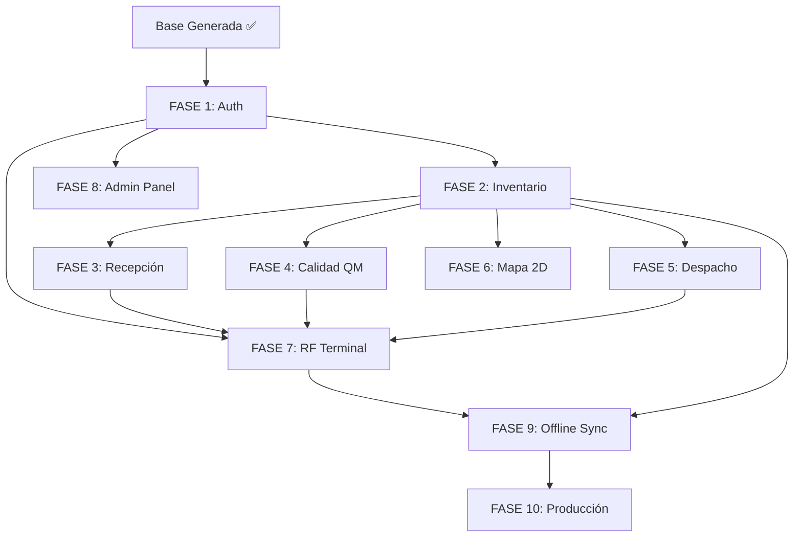

# 4GUARD WMS — Frontend Implementation Plan

> **Proyecto:** 4GUARD WMS 3PL Frontend  
> **Stack:** Angular 17+ · Signals · PWA · Monorepo  
> **Versión del Plan:** 1.0  
> **Fecha:** 2026-06-21  

---

## 📋 Resumen Ejecutivo

El frontend de 4GUARD WMS está estructurado como un **monorepo Angular 17+** con dos aplicaciones independientes y una librería compartida. Este plan detalla el orden de implementación de cada módulo, las dependencias entre ellos, y los criterios de aceptación por sprint.

```
4Guard_FE_UI/
├── apps/admin-console/   ← SPA Desktop  (puerto 4200)
├── apps/rf-terminal/     ← PWA Tablet   (puerto 4201)
└── libs/shared-core/     ← Lógica compartida (modelos, servicios, estado)
```

---

## 🧱 Fundamentos ya implementados (Base)

| Archivo / Módulo | Estado | Descripción |
|------------------|--------|-------------|
| `angular.json` | ✅ Completo | Config monorepo 3 proyectos |
| `tsconfig.base.json` | ✅ Completo | Alias `@4guard/shared-core` |
| `package.json` | ✅ Completo | Angular 17.3, Dexie, RxJS 7.8 |
| `libs/shared-core` — Domain | ✅ Completo | 5 modelos + 2 enums (FSM, RBAC) |
| `libs/shared-core` — Infrastructure | ✅ Completo | 2 interceptores + 3 servicios singleton |
| `libs/shared-core` — Application | ✅ Completo | 3 Signal Stores (Auth, Inventory, Sync) |
| `apps/admin-console` — Shell | ✅ Completo | Sidebar + Header + Router Outlet |
| `apps/admin-console` — Guards | ✅ Completo | AuthGuard + RbacGuard |
| `apps/admin-console` — Dashboard | ✅ Completo | KPI Cards con Signals |
| `apps/admin-console` — StatusBadge | ✅ Completo | Badge FSM animado (8 estados) |
| `apps/rf-terminal` — PWA Config | ✅ Completo | Service Worker + Manifest |
| `apps/rf-terminal` — ScanInput | ✅ Completo | Input táctil 44px industrial |
| Design Tokens CSS | ✅ Completo | Sistema completo Antigravity |
| `README.md` | ✅ Completo | Documentación del workspace |

---

## 🗺️ Roadmap de Implementación

```
FASE 1 ─── AUTENTICACIÓN Y SESIÓN
FASE 2 ─── ADMIN-CONSOLE: INVENTARIO
FASE 3 ─── ADMIN-CONSOLE: RECEPCIÓN
FASE 4 ─── ADMIN-CONSOLE: CALIDAD (QM)
FASE 5 ─── ADMIN-CONSOLE: DESPACHO
FASE 6 ─── ADMIN-CONSOLE: REPORTES Y MAPA 2D
FASE 7 ─── RF-TERMINAL: FLUJOS OPERATIVOS
FASE 8 ─── ADMIN-CONSOLE: PANEL ADMIN
FASE 9 ─── OFFLINE SYNC COMPLETO (DEXIE.JS)
FASE 10 ── POLISH: PRUEBAS, A11Y Y PRODUCCIÓN
```

---

## 📐 FASE 1 — Autenticación y Sesión

> **Prioridad: CRÍTICA.** Todos los módulos dependen de esto.

### 1.1 Login — `admin-console`

#### Archivos a crear:
```
apps/admin-console/src/app/features/auth/
├── login/
│   ├── login.component.ts
│   ├── login.component.html
│   └── login.component.css
```

#### Criterios de aceptación:
- [ ] Formulario reactivo con validación (`email` + `password`)
- [ ] Llamada a `AuthState.login()` con manejo de loading/error
- [ ] Redirección post-login según rol (definida en `AuthState.redirectAfterLogin()`)
- [ ] Persistencia de sesión: al recargar, si el token es válido, redirige al dashboard
- [ ] Diseño Antigravity: pantalla dividida (branding + formulario)
- [ ] Manejo de error 401 con mensaje visible al usuario

### 1.2 Login — `rf-terminal`

#### Archivos a crear:
```
apps/rf-terminal/src/app/features/auth/
├── rf-login/
│   ├── rf-login.component.ts
│   ├── rf-login.component.html
│   └── rf-login.component.css
```

#### Criterios de aceptación:
- [ ] Botones grandes (touch target mínimo 56px)
- [ ] Teclado numérico opcional (PIN o código de empleado)
- [ ] Soporte de login offline si el token previo no expiró
- [ ] Tema oscuro con alto contraste

### 1.3 RF Shell Layout — `rf-terminal`

#### Archivos a crear:
```
apps/rf-terminal/src/app/shared/components/rf-shell/
├── rf-shell.component.ts
├── rf-shell.component.html
└── rf-shell.component.css
```

#### Criterios de aceptación:
- [ ] Header con nombre de usuario, sucursal e indicador de conectividad
- [ ] Menú inferior (bottom nav) con iconos grandes para cada flujo operativo
- [ ] Banner offline visible cuando `SyncState.isOffline() === true`
- [ ] Botón de sincronización manual cuando hay pendientes

---

## 📦 FASE 2 — Admin-Console: Módulo de Inventario

### 2.1 Repository: `InventoryRepository`

#### Archivo a crear:
```
apps/admin-console/src/app/data/repositories/inventory.repository.ts
```

#### Responsabilidades:
- [ ] `getItems(filter: ItemFilter): Observable<PagedItemResponse>`
- [ ] `getItemById(id: string): Observable<Item>`
- [ ] `updateItemStatus(id: string, newStatus: InventoryStatus, notes?: string): Observable<Item>`
- [ ] Usa `BackendService` internamente

### 2.2 Lista de Inventario

#### Archivos a crear:
```
apps/admin-console/src/app/features/inventory/
├── inventory-list/
│   ├── inventory-list.component.ts
│   ├── inventory-list.component.html
│   └── inventory-list.component.css
```

#### Criterios de aceptación:
- [ ] Tabla paginada con columnas: SKU, Descripción, Lote, Estado (badge), Ubicación, Cliente, Acciones
- [ ] Filtros: por estado FSM (chips), SKU (search), cliente (select)
- [ ] Paginación con `InventoryState.goToPage()`
- [ ] Click en fila navega a detalle
- [ ] Skeleton loader mientras `isLoading()`
- [ ] Estado vacío con ilustración cuando no hay ítems
- [ ] Exportar a CSV (básico)

### 2.3 Detalle de Ítem

#### Archivos a crear:
```
apps/admin-console/src/app/features/inventory/
├── inventory-detail/
│   ├── inventory-detail.component.ts
│   ├── inventory-detail.component.html
│   └── inventory-detail.component.css
```

#### Criterios de aceptación:
- [ ] Datos completos del ítem en layout de tarjetas
- [ ] FSM Viewer: diagrama visual de los 8 estados con el actual resaltado
- [ ] Botones de transición: solo muestra las transiciones **válidas** desde el estado actual
- [ ] Modal de confirmación antes de cambiar estado (con campo de notas)
- [ ] Historial de cambios de estado (si el API lo provee)
- [ ] Datos de ubicación con badge de ocupación

---

## 🚛 FASE 3 — Admin-Console: Módulo de Recepción

### 3.1 Repository: `ReceivingRepository`

```
apps/admin-console/src/app/data/repositories/receiving.repository.ts
```

- [ ] `getReceipts(filter): Observable<PagedResponse<Receipt>>`
- [ ] `getReceiptById(id: string): Observable<Receipt>`
- [ ] `updateReceiptLine(receiptId, lineId, data): Observable<ReceiptLine>`
- [ ] `completeReceipt(id: string): Observable<Receipt>`

### 3.2 Lista de Recepciones

```
apps/admin-console/src/app/features/receiving/
├── receiving-list/
│   ├── receiving-list.component.ts
│   ├── receiving-list.component.html
│   └── receiving-list.component.css
```

- [ ] Lista paginada de recepciones con estado visual (badge)
- [ ] Filtros: por estado, cliente, fecha, andén
- [ ] Badge de discrepancia si `ReceiptStatus.DISCREPANCY`
- [ ] Acceso rápido a recepciones del día

### 3.3 Detalle de Recepción

```
apps/admin-console/src/app/features/receiving/
├── receiving-detail/
│   ├── receiving-detail.component.ts
│   ├── receiving-detail.component.html
│   └── receiving-detail.component.css
```

- [ ] Encabezado con datos del ASN (cliente, fecha, andén)
- [ ] Tabla de líneas: SKU esperado vs recibido, diferencia destacada en rojo/verde
- [ ] Botón "Completar Recepción" (requiere rol DOCK_SUPERVISOR o superior)
- [ ] Resumen de discrepancias con posibilidad de añadir notas

---

## 🔍 FASE 4 — Admin-Console: Control de Calidad (QM)

### 4.1 Repository: `QualityRepository`

```
apps/admin-console/src/app/data/repositories/quality.repository.ts
```

- [ ] `getQuarantineItems(branchId): Observable<Item[]>` — Estado 20
- [ ] `getBlockedItems(branchId): Observable<Item[]>` — Estado 70
- [ ] `approveItem(id, notes): Observable<Item>` — 20→30 o 70→30
- [ ] `rejectItem(id, notes): Observable<Item>` — →70 o →80

### 4.2 Dashboard QM

```
apps/admin-console/src/app/features/quality/
├── quality-list/
│   ├── quality-list.component.ts
│   ├── quality-list.component.html
│   └── quality-list.component.css
```

- [ ] Dos vistas: Cuarentena (estado 20) y Bloqueados QM (estado 70)
- [ ] Contador de alerta en el nav item cuando hay ítems en cuarentena
- [ ] Acciones rápidas: Aprobar / Bloquear / Dar de baja
- [ ] Filtros por cliente, lote, fecha de recepción

### 4.3 Formulario de Inspección

```
apps/admin-console/src/app/features/quality/
├── quality-inspection/
│   ├── quality-inspection.component.ts
│   ├── quality-inspection.component.html
│   └── quality-inspection.component.css
```

- [ ] Checklist de inspección configurable
- [ ] Campo obligatorio de notas para transiciones a estado 70 o 80
- [ ] Confirmación de transición con FSM validation (`isValidTransition()`)

---

## 📤 FASE 5 — Admin-Console: Módulo de Despacho

### 5.1 Repository: `ShippingRepository`

```
apps/admin-console/src/app/data/repositories/shipping.repository.ts
```

- [ ] `getTransferOrders(filter): Observable<PagedResponse<TransferOrder>>`
- [ ] `getTransferOrderById(id): Observable<TransferOrder>`
- [ ] `assignOperator(orderId, operatorId): Observable<TransferOrder>`
- [ ] `dispatchOrder(orderId): Observable<TransferOrder>`

### 5.2 Lista de Órdenes de Transferencia

```
apps/admin-console/src/app/features/shipping/
├── shipping-list/
│   ├── shipping-list.component.ts
│   ├── shipping-list.component.html
│   └── shipping-list.component.css
```

- [ ] Tabla con prioridad visual (color por nivel 1-5)
- [ ] Filtros: estado, tipo (OUTBOUND/INTERNAL/RETURN), cliente, fecha límite
- [ ] Alerta de órdenes vencidas (`dueDate` < hoy)
- [ ] Asignación de operario desde la lista (dropdown)

---

## 🗺️ FASE 6 — Admin-Console: Mapa 2D del Almacén + Reportes

### 6.1 Mapa 2D (SVG)

```
apps/admin-console/src/app/features/inventory/
├── warehouse-map/
│   ├── warehouse-map.component.ts
│   ├── warehouse-map.component.html
│   └── warehouse-map.component.css
```

- [ ] Renderizado SVG de las ubicaciones usando `Location.coords2D`
- [ ] Color de celda según ocupación: verde < 70%, ámbar 70-90%, rojo > 90%
- [ ] Click en celda muestra popup con ítems en esa ubicación
- [ ] Filtro por tipo de zona (RACK, DOCK, STAGING, QUARANTINE_ZONE)
- [ ] Zoom básico con CSS transform

### 6.2 Módulo de Reportes

```
apps/admin-console/src/app/features/dashboard/
├── reports/
│   ├── reports.component.ts
│   ├── reports.component.html
│   └── reports.component.css
```

- [ ] Reporte de inventario por estado (tabla + gráfica de donut)
- [ ] Reporte de recepciones del período (tabla + gráfica de barras)
- [ ] Reporte de órdenes de despacho completadas
- [ ] Exportar a CSV/PDF
- [ ] Librerías de gráficas: considerar `Chart.js` (ligero, sin deps pesadas)

---

## 📱 FASE 7 — RF Terminal: Flujos Operativos

### 7.1 Flujo de Recepción (Scan)

```
apps/rf-terminal/src/app/features/receiving/
├── receiving-scan/
│   ├── receiving-scan.component.ts
│   ├── receiving-scan.component.html
│   └── receiving-scan.component.css
```

- [ ] Selección de recepción activa (lista simple o escaneo de QR del ASN)
- [ ] Escaneo de código de barras con `ScanInputComponent`
- [ ] Confirmación por ítem: checkmark visual en grande (alta legibilidad)
- [ ] Manejo offline: si sin WiFi, encolar en `SyncState` y guardar en IndexedDB
- [ ] Vibración háptica en escaneo exitoso / doble vibración en error

### 7.2 Flujo de Putaway (Ubicación)

```
apps/rf-terminal/src/app/features/putaway/
├── putaway-scan/
│   ├── putaway-scan.component.ts
│   ├── putaway-scan.component.html
│   └── putaway-scan.component.css
```

- [ ] Paso 1: Escanear ítem (barcode)
- [ ] Paso 2: Escanear ubicación destino (código de rack)
- [ ] Validación de compatibilidad ítem-ubicación (restricciones)
- [ ] Confirmación visual grande: código + ubicación + botón CONFIRMAR (72px)

### 7.3 Flujo de Picking

```
apps/rf-terminal/src/app/features/picking/
├── picking-list/
│   ├── picking-list.component.ts
│   ├── picking-list.component.html
│   └── picking-list.component.css
├── picking-scan/
│   ├── picking-scan.component.ts
│   ├── picking-scan.component.html
│   └── picking-scan.component.css
```

- [ ] Lista de órdenes asignadas al operario logueado
- [ ] Por cada línea: mostrar SKU, cantidad y ubicación en grande
- [ ] Escaneo de confirmación por línea
- [ ] Progreso de la orden: barra de avance (X de N líneas)
- [ ] Completar orden → actualiza estado a `READY_TO_SHIP`

### 7.4 Flujo de Conteo

```
apps/rf-terminal/src/app/features/counting/
├── counting-scan/
│   ├── counting-scan.component.ts
│   ├── counting-scan.component.html
│   └── counting-scan.component.css
```

- [ ] Escaneo de código → mostrar datos del ítem → ingresar cantidad encontrada
- [ ] Modo de conteo ciego (sin mostrar cantidad esperada, para auditoría)
- [ ] Historial de la sesión de conteo

### 7.5 Flujo de Inspección QM (Tablet)

```
apps/rf-terminal/src/app/features/quality/
├── quality-inspection/
│   ├── quality-inspection.component.ts
│   ├── quality-inspection.component.html
│   └── quality-inspection.component.css
```

- [ ] Escaneo del ítem en cuarentena
- [ ] Checklist de inspección con botones grandes SI/NO
- [ ] Decisión final: APROBAR (→30) / BLOQUEAR (→70) con campo de notas obligatorio
- [ ] Firma digital simple (si el dispositivo lo soporta)

---

## ⚙️ FASE 8 — Admin-Console: Panel de Administración

```
apps/admin-console/src/app/features/admin/
├── admin-panel/
│   ├── admin-panel.component.ts
│   ├── admin-panel.component.html
│   └── admin-panel.component.css
├── users/
│   ├── users-list.component.ts
│   ├── users-list.component.html
│   └── users-list.component.css
```

- [ ] Lista de usuarios con rol, sucursal y estado activo
- [ ] Crear/Editar usuario (formulario con validación)
- [ ] Activar/Desactivar usuario
- [ ] Configuración de sucursales (CRUD básico)
- [ ] Solo accesible para `ROLE_ADMIN`

---

## 💾 FASE 9 — Offline Sync Completo (Dexie.js)

### 9.1 Schema de Dexie

```
apps/rf-terminal/src/app/data/offline-db/
├── 4guard.db.ts          ← Instancia Dexie + definición de tablas
├── offline-item.dao.ts   ← Data Access Object para ítems
├── offline-receipt.dao.ts
└── offline-order.dao.ts
```

#### Schema de la base de datos local:
```typescript
// Tablas IndexedDB via Dexie
items:      '++id, sku, status, locationId, branchId'
receipts:   '++id, asnReference, status, branchId'
orders:     '++id, orderNumber, status, assignedOperatorId'
syncQueue:  '++id, method, url, createdAt, retryCount, failed'
```

### 9.2 Estrategia Offline

| Operación | Comportamiento Online | Comportamiento Offline |
|-----------|----------------------|------------------------|
| GET Ítems | API → cache IndexedDB | Leer desde IndexedDB |
| Confirmar Escaneo | POST directo a API | Encolar en `SyncQueue` |
| Cambio de Estado | PATCH a API | Encolar + actualizar IndexedDB |
| Login | POST a API | Verificar token local (si no expiró) |

---

## 🧪 FASE 10 — Polish, Pruebas y Producción

### 10.1 Testing

- [ ] **Unit tests** para todos los Signal Stores (`*.state.spec.ts`)
- [ ] **Unit tests** para la FSM (`isValidTransition()`)
- [ ] **Unit tests** para pipes y directivas
- [ ] **Integration tests** para guards (AuthGuard, RbacGuard)
- [ ] **E2E básico** con Playwright para flujos críticos (login → inventory)

### 10.2 Accesibilidad (A11Y)

- [ ] Audit con axe-core en todos los componentes
- [ ] Verificar `aria-label` en todos los elementos interactivos
- [ ] Navegación por teclado completa en admin-console
- [ ] Contraste mínimo AA en rf-terminal
- [ ] `prefers-reduced-motion` para las animaciones

### 10.3 Performance

- [ ] Bundle analysis: `ng build --stats-json` + `webpack-bundle-analyzer`
- [ ] Lazy loading verificado (sin eager imports ocultos)
- [ ] Imágenes optimizadas con WebP
- [ ] Fonts con `font-display: swap`
- [ ] Service Worker: verificar caché offline en Lighthouse

### 10.4 CI/CD

```yaml
# Sugerencia de pipeline:
stages:
  - lint       # ng lint
  - build:lib  # ng build shared-core
  - build:apps # ng build admin-console && ng build rf-terminal
  - test       # ng test --watch=false
  - deploy:staging
  - deploy:production
```

---

## 🔗 Dependencias entre Fases



---

## 📊 Estimación de Esfuerzo

| Fase | Módulo | Complejidad | Estimado |
|------|--------|-------------|----------|
| 1 | Auth (login + session) | Media | 2 días |
| 2 | Inventario completo | Alta | 4 días |
| 3 | Recepción | Media | 3 días |
| 4 | Control de Calidad | Media | 3 días |
| 5 | Despacho | Media | 3 días |
| 6 | Mapa 2D + Reportes | Alta | 5 días |
| 7 | RF Terminal (5 flujos) | Alta | 5 días |
| 8 | Panel Admin | Baja | 2 días |
| 9 | Offline Sync Dexie | Muy Alta | 6 días |
| 10 | Tests + A11Y + Prod | Alta | 4 días |
| **Total** | | | **~37 días** |

---

## 🎨 Guía de Referencia Rápida

### Importar desde la librería compartida
```typescript
import {
  // Domain
  Item, Location, Receipt, TransferOrder, User,
  InventoryStatus, UserRole,
  isValidTransition, INVENTORY_STATUS_LABELS,
  // Infrastructure
  AuthService, BackendService, SyncService,
  jwtInterceptor, branchInterceptor,
  // Application
  AuthState, InventoryState, SyncState,
} from '@4guard/shared-core';
```

### Generar un nuevo componente (estándar del proyecto)
```bash
# admin-console
ng generate component features/mi-feature/mi-componente \
  --project=admin-console \
  --standalone \
  --style=css \
  --skip-tests=false

# rf-terminal
ng generate component features/mi-feature/mi-componente \
  --project=rf-terminal \
  --standalone \
  --style=css
```

### Tokens CSS de uso frecuente
```css
/* Colores semánticos */
var(--color-primary)   /* Azul Naval */
var(--color-danger)    /* Rojo QM Bloqueado */
var(--color-warning)   /* Ámbar Cuarentena */
var(--color-success)   /* Verde Disponible */

/* Status FSM */
var(--status-20-color) /* Color texto Cuarentena */
var(--status-20-bg)    /* Fondo Cuarentena */
var(--status-70-color) /* Color texto Bloqueado QM */

/* RF Tablet */
var(--rf-touch-min)          /* 44px — touch target mínimo */
var(--rf-touch-comfortable)  /* 56px — touch target cómodo */
var(--rf-font-size-scan)     /* 48px — código escaneado */
```

---

*4GUARD WMS Frontend Implementation Plan — Generado automáticamente por el equipo de arquitectura*
