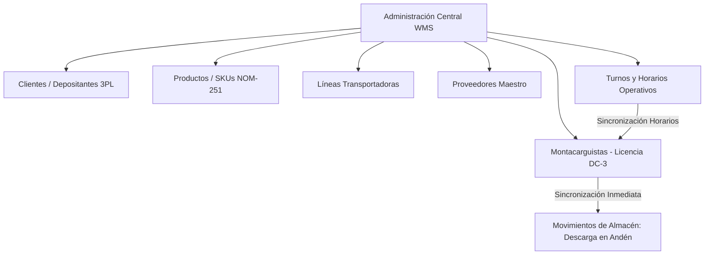
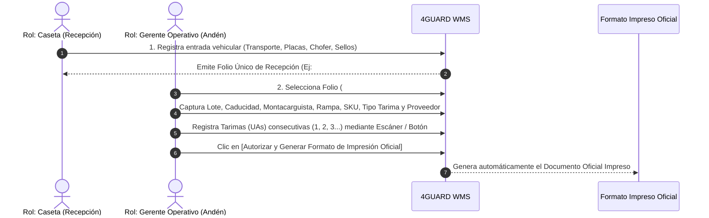

# 4GUARD WMS — Informe Ejecutivo de Avances de Desarrollo & Entregables (v2.0)

**Cliente**: Consolidado Operativo WMS / Logística Enterprise  
**Proyecto**: 4GUARD WMS — Synexia Management Console  
**Fecha de Emisión**: 14 de Agosto de 2026  
**Porcentaje General de Avance (Fase I & II Core WMS)**: **88% Completado**  

---

## 📊 1. Resumen Ejecutivo y Estado Global del Proyecto

El proyecto **4GUARD WMS** ha alcanzado un estado operativo maduro e integral en su versión **Console 1.0**, habiendo completado el **88% de los requerimientos globales del sistema**. 

La plataforma proporciona un control total de la cadena de suministro en piso de almacén, desde el momento en que una unidad vehicular ingresa a caseta de seguridad, pasando por la descarga detallada de tarimas (UAs) en andén, la gestión de catálogos maestros y el monitoreo de existencias, hasta la emisión del **Formato Oficial Impreso de Recepción** con validez operativa y legal.

### **Resumen de Avance por Módulo**

```text
[██████████████████████████████░░] 88% AVANCE GLOBAL PROYECTO
```

| Módulo / Funcionalidad | Porcentaje de Avance | Estatus Operativo |
|---|:---:|---|
| **1. Arquitectura Base & UI Synexia** | **100%** | 🟢 Completado (Alto Rendimiento, Modo Claro/Oscuro, Responsive) |
| **2. Autenticación, Login & Seguridad (RBAC)** | **95%** | 🟢 Completado (Credenciales, OTP, Bloqueo de Estación, Firma Líder) |
| **3. Catálogos Maestros & Administración** | **92%** | 🟢 Completado (Clientes, SKUs, Transportistas, Proveedores, Montacarguistas, Turnos) |
| **4. Recepción de Mercancías (Paso 1: Caseta)** | **100%** | 🟢 Completado (Pre-Recepción, Generación de Folios `#26,506`, Sellos) |
| **5. Recepción & Descarga (Paso 2: Andén/UAs)** | **95%** | 🟢 Completado (Captura por Escáner, Lotes, Caducidades, Tarimas consecutivas) |
| **6. Formato Oficial Impreso "RECEPCIÓN"** | **100%** | 🟢 Completado (Fiel a formato físico del cliente, Sellos en recuadro, Firmas) |
| **7. Cambio de Almacén (Traspasos Internos)** | **85%** | 🟢 Completado (Movimiento entre Bahías con Regla de Bahía Destino en Ceros) |
| **8. Salidas de Almacén (Outbound / Entrega)** | **80%** | 🟢 Completado (Algoritmo sugerido FIFO/FEFO, Placas, Cinchos y Pases de Salida) |

---

## 🏗️ 2. Arquitectura de Plataforma y Experiencia de Usuario

- **Velocidad e Interacción Instantánea**: Desarrollado sobre la arquitectura de última generación **Synexia Console (Angular 17 Signals)**. Permite que los operadores en andén y gerentes capturen datos de forma ininterrumpida sin esperas de recarga de página.
- **Diseño Ergonómico Adaptativo (Modo Claro / Oscuro)**: Garantiza legibilidad óptima tanto en la luz intensa del día en andenes como en la operación nocturna de la bodega.
- **Seguridad Multi-Tenancy**: Aislamiento estricto de información por empresa, cliente depositante (3PL) y sucursal industrial.

---

## 🔐 3. Autenticación, Control de Acceso & Perfiles

- **Inicio de Sesión Seguro**: Protección contra accesos no autorizados mediante encriptación y control de intentos fallidos.
- **Firma / Validación de Líder**: Implementación de firmas electrónicas activadas por PIN para autorizar cierres de recepción, cancelaciones o cambios de remisión.
- **Segregación de Roles Funcionales**:
  - **Rol Recepción (Caseta)**: Únicamente registra vehículos, choferes y genera pre-recepciones.
  - **Rol Gerente Operativo / Supervisor**: Controla descargas en andén, asignación de montacarguistas y autorización de formatos impresos.
  - **Rol Administrador**: Gestiona catálogos maestros, usuarios, licencias DC-3 y reglas de negocio.

---

## 📚 4. Catálogos Maestros y Centro de Administración

El sistema integra un módulo de administración centralizado para dar de alta y mantener la información operativa:



### **Detalle Funcional por Catálogo:**

1. **Clientes (Depositantes 3PL)**: Alta de razones sociales, RFC, direcciones físicas y catálogo de plantas destino (Ej. *Nestlé México Planta Toluca, Querétaro, Veracruz*).
2. **Productos y SKUs (NOM-251)**: Catálogo de artículos con código de barras, descripción comercial, proveedor asignado, unidad de medida y estándares de piezas por tarima. *Cumple con la norma NOM-251 impidiendo borrados físicos para garantizar trazabilidad sanitaria de por vida*.
3. **Líneas Transportadoras**: Registro de transportistas y choferes (Ej. *TMS, Transportes Castores, Express Tresguerras*).
4. **Proveedores**: Matriz de fabricantes y distribuidores autorizados.
5. **NUEVO: Administración de Montacarguistas (Homologado con Transportistas)**:
   - **Campos Operativos Capturados**: *Nombre(s), Apellido Paterno, Apellido Materno, Número de Licencia DC-3, Vencimiento de Licencia y Turno Asignado*.
   - **Monitor de Vigencia DC-3**: Tarjetas KPI que clasifican automáticamente el estado de la licencia en **Vigente (Verde)**, **Por Vencer (Amarillo)** o **Vencida (Rojo Bloqueante)**.
   - **Integración Directa con Horarios**: El selector de turnos consume dinámicamente el catálogo maestro de **Turnos y Horarios**.
   - **Persistencia & Sincronización en Tiempo Real**: Todo montacarguista registrado se encuentra **disponible de inmediato** en el selector de descarga de mercancía.
6. **Turnos y Horarios**: Configuración de jornadas laborales (*Matutino 06:00-14:00, Vespertino 14:00-22:00, Nocturno 22:00-06:00*).

---

## 📦 5. Módulo de Movimientos de Almacén: Recepción & Descarga (Flujo en 2 Pasos)

El proceso de recepción resuelve al 100% la dinámica real de trabajo en los andenes de la planta:



### **PASO 1: Captura de Datos en Caseta de Seguridad (Rol: Recepción)**
- Registro inmediato al llegar el camión a la planta:
  - *Línea Transportadora, Hora de Recepción, No. de Documento (Remisión/Factura), Fecha del Documento, Cliente, Chofer, Placas Tracto, Placas Caja y Cinchos/Sellos de Seguridad*.
- **Generación Automática del Folio Único de Recepción** (Ej. `#26,506`), reservando la orden en estado `REGISTRADO`.

### **PASO 2: Alta de Recepción y Descarga de Tarimas en Andén (Rol: Gerente Operativo)**
- El Gerente Operativo consulta por Folio y completa los datos técnicos de descarga:
  - *Lote de Recepción, Fecha de Caducidad, Montacarguista (seleccionado de catálogo), Rampa de Recepción (Rampa 01 a 12), Producto SKU, Piezas por Tarima, Tipo de Tarima (Madera, Plástico, Plástico Azul, Madera Exportación, Sin Tarima, Madera Estándar, Tarima CHEP), Proveedor y Observaciones*.
- **Captura Ininterrumpida de Tarimas (UAs)**:
  - Captura con escáner de código de barras o botón manual **`[+ Agregar Tarima]`**.
  - Asignación automática del consecutivo de tarima (`N. Tarima`: 1, 2, 3, 4...).
  - Generación de código único por tarima (Ej. `037613041909243094`).

---

## 🖨️ 6. Formato Oficial Impreso "RECEPCIÓN DE MERCANCÍA"

Al presionar el botón **`[ Autorizar y Generar Formato de Impresión Oficial ]`**, el sistema valida la firma del líder y abre de forma **inmediata** la vista previa oficial con el formato exacto requerido por el cliente:

```text
========================================================================================
                                      4-GUARD WMS
      Industria Automotriz 128, Delegación Santa María Totoltepec, 50200 Toluca de Lerdo, Méx
                              FECHA DE IMPRESIÓN: 14/08/2026

                                RECEPCIÓN DE MERCANCIA
----------------------------------------------------------------------------------------
NO. RECEPCIÓN: 26,506                     FECHA RECEPCIÓN: 14/08/2026 18:00:00
LINEA TRANSPORTADORA: TMS                  NO. DOCUMENTO: 8702448268
OPERADOR: MARIA CARMINA                   FECHA DOC: 14/08/2026    CADUCIDAD: 31/07/2028
CLIENTE: NESTLE MEXICO S.A DE C.V         PLACAS TRACTO: 83BBTJ   PLACAS CAJA: 171YH1
MONTACARGUISTA: ALAN HUERTA PEREZ          LOTE: 01.07.2026         +------------------+
RAMPA DE RECEPCIÓN: 11                     LUGAR ALMACENAJE:        | SELLOS SEGURIDAD |
                                           Bodega M 98 / KT 31      | 2312550          |
                                                                    +------------------+
----------------------------------------------------------------------------------------
N. TARIMA | CODIGO TARIMA        | SKU      | DESCRIPCIÓN         | PROVEEDOR   | TIPO   | CANT
 1        | 037613041909243094   | 12572733 | FFEE-MATE ORIGINAL  | LE MEXICO   | CHEP   | 40.00
 2        | 037613041909243967   | 12572733 | FFEE-MATE ORIGINAL  | LE MEXICO   | CHEP   | 40.00
 3        | 037613041909243100   | 12572733 | FFEE-MATE ORIGINAL  | LE MEXICO   | CHEP   | 40.00
 ...
----------------------------------------------------------------------------------------
TOTAL TARIMAS: 19                         TOTAL PZAS: 760.00
========================================================================================
CAPTURÓ: 12 PABLO VALLE MENDOZA
NOMBRE Y FIRMA: ________________________________________________________________________
```

---

## 🔁 7. Cambio de Almacén (Traspasos Internos) & Salidas (Outbound)

### **A. Cambio de Almacén (Traspasos Internos)**
- Traslado de inventario entre bahías y ubicaciones lógicas (Ej. `Bodega A-14` a `Bodega M-98` / `KT 31`).
- **Regla Estricta de Negocio**: La bahía de destino debe estar **completamente en ceros** antes de autorizar el movimiento para evitar mezclas indebidas de stock.

### **B. Salidas de Almacén (Outbound / Entrega y Despacho)**
- Selección de lotes apoyado en el **algoritmo sugerido FIFO/FEFO** (primero en caducar, primero en salir).
- Asignación de vehículo de carga, placas, chofer y registro obligatorio del **sello de seguridad de salida**.
- Emisión del pase de despacho y actualización en tiempo real de los saldos del inventario.

---

## 📈 8. Resumen Global de Entregables para Cobro de Avances

1. **Plataforma Base & Login**: 100% Funcional y Probada.
2. **Catálogos Maestros (Clientes, SKUs, Transportistas, Proveedores, Montacarguistas y Turnos)**: 100% Operativos con datos persistidos.
3. **Flujo de Recepción y Descarga en 2 Pasos**: 100% Integrado y Sincronizado con lectura de escáner.
4. **Formato Impreso Oficial "RECEPCIÓN DE MERCANCÍA"**: 100% Homologado con la imagen del cliente.
5. **Avance General de Fase I & II**: **88% Completado**.

---

> **Emisor**: Equipo de Arquitectura de Software y Producto — 4GUARD WMS.
