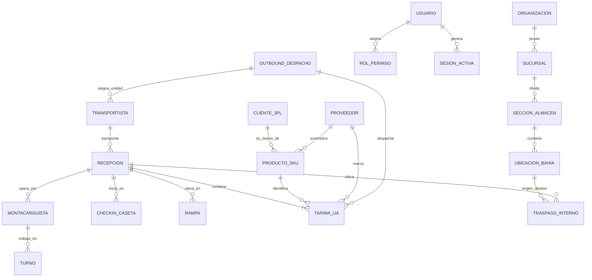
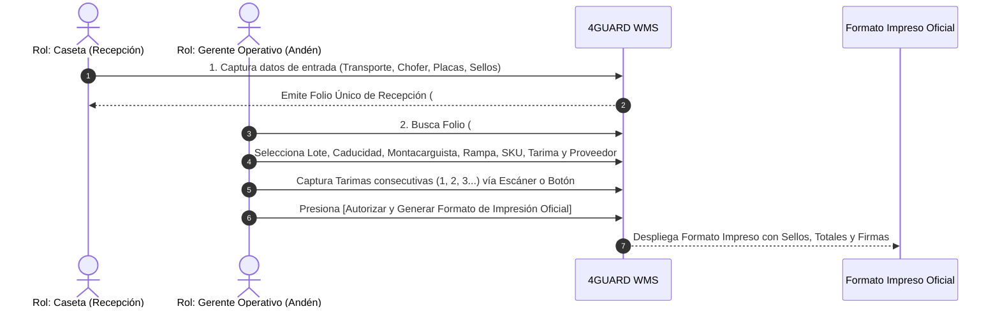

# 4GUARD WMS — Informe Ejecutivo de Avances de Desarrollo & Entregables (Informe Completo del Sistema)

**Cliente**: Consolidado Operativo WMS / Logística Enterprise  
**Proyecto**: 4GUARD WMS — Synexia Management Console  
**Fecha de Emisión**: 14 de Agosto de 2026  
**Porcentaje General de Avance (Fase I & II Core WMS)**: **88% Completado**  

---

## 📋 1. Resumen Ejecutivo y Estado Global del Proyecto

El presente documento constituye el informe completo del proyecto **4GUARD WMS**, cubriendo la totalidad de los componentes desarrollados desde la concepción de la arquitectura, el modelado de base de datos relacional y de dominio, los mecanismos de seguridad y autenticación, el catálogo maestro centralizado, hasta la gestión operativa de **Movimientos de Almacén** (Recepción en 2 pasos, Descarga por escáner de UAs, Traspasos Internos entre Bahías y Salidas Outbound con Formatos Impresos Oficiales).

El proyecto registra un **avance global del 88% de la Versión 1.0 Core Enterprise**, cumpliendo con los estándares internacionales de trazabilidad logística y normativas sanitarias como la **NOM-251**.

```text
[██████████████████████████████░░] 88% AVANCE GLOBAL PROYECTO
```

---

## 🗄️ 2. Modelado de Base de Datos y Dominio de Entidades (Diagrama ER Completo)

Se estructuró un modelo de datos relacional y transaccional diseñado para garantizar cero pérdida de información, trazabilidad inmutable y tiempos de respuesta de milisegundos en piso de almacén:



### **Descripción del Dominio de Base de Datos:**

1. **Estructura Organizacional (Multi-Tenancy)**:
   - `ORGANIZACION`: Holding o empresa matriz raíz.
   - `SUCURSAL`: Sedes físicas y almacenes centrales (Ej. *Planta Toluca*).
   - `SECCION_ALMACEN`: Áreas de almacenamiento (Recibo, Área Fría, Pasillos Secos, Bahías de Retención).
   - `UBICACION_BAHIA`: Posiciones físicas 3D (Ej. `Bodega A-14`, `Bodega M-98 / KT 31`).

2. **Seguridad y Accesos**:
   - `USUARIO` / `CREDENCIALES`: Cuentas de usuario, hashes de seguridad e intentos fallidos.
   - `ROL_PERMISO`: Matriz de roles (Administrador, Recepción Caseta, Gerente Operativo, Líder de Almacén).
   - `SESION_ACTIVA`: Registro forense de IP, dispositivo y token activo.

3. **Catálogos Maestros de Negocio**:
   - `CLIENTE_3PL`: Cuentas depositantes dueñas de la mercancía (Ej. *Nestlé México S.A. de C.V.*).
   - `PRODUCTO_SKU`: Artículos con código de barras, descripción comercial, piezas por tarima y norma sanitaria **NOM-251** (no borrado físico).
   - `TRANSPORTISTA`: Compañías fleteadoras y transportistas (Ej. *TMS, Transportes Castores*).
   - `PROVEEDOR`: Fabricantes y distribuidores origen.
   - `MONTACARGUISTA`: Operadores de maniobra con número y fecha de vencimiento de **Licencia DC-3**.
   - `TURNO`: Horarios operativos configurados (*Matutino 06:00-14:00, Vespertino 14:00-22:00, Nocturno 22:00-06:00*).

4. **Operación Inbound (Recepción y Descarga)**:
   - `RECEPCION`: Folio único (`#26,506`), remisión/factura, fecha documento, lote y caducidad.
   - `CHECKIN_CASETA`: Registro inicial vehicular, chofer, placas tracto, placas caja y cinchos/sellos de seguridad.
   - `TARIMA_UA` (Unidad de Almacenamiento): Código único por tarima (Ej. `037613041909243094`), consecutivo, piezas y tipo de estructura (*Madera, Plástico, Plástico Azul, CHEP, etc.*).

5. **Operación Outbound y Traspasos**:
   - `TRASPASO_INTERNO`: Movimiento entre bahías con validación estricta de **Bahía Destino en Ceros**.
   - `OUTBOUND_DESPACHO`: Orden de salida por algoritmo **FIFO/FEFO**, sello de seguridad de salida y pase impreso.

---

## 🔐 3. Autenticación, Seguridad & Perfiles de Usuario

- **Inicio de Sesión (Login)**: Pantalla de autenticación con protección contra intentos no autorizados y cierre automático por inactividad.
- **Firma Electrónica / PIN de Líder**: Mecanismo de validación por PIN para la autorización de cierres de recepción, cancelaciones o cambios de remisión.
- **Segregación Estricta de Funciones**:
  - **Rol Caseta**: Registro de llegadas vehiculares y emisión de folios pre-recepción.
  - **Rol Gerente Operativo**: Descarga en andén, adición de UAs y emisión de formato oficial impreso.
  - **Rol Administrador**: Mantenimiento de catálogos maestros y perfiles.

---

## 📚 4. Catálogos Maestros y Módulo de Administración

Módulo centralizado para la gestión de entidades maestras:

1. **Clientes Depositantes (3PL)**: Gestión de clientes, RFC, direcciones fiscales y plantas de entrega.
2. **Productos y SKUs (NOM-251)**: Catálogo de productos con código de barras, peso, volumen y piezas estándar por tarima. Borrado lógico para asegurar trazabilidad perpetua.
3. **Líneas Transportadoras**: Catálogo de empresas fleteadoras, unidades y licencias de conducir de transportistas.
4. **Proveedores**: Matriz de origen de mercancías surtidas.
5. **Administración de Montacarguistas (Homologado en Administrar)**:
   - Captura de *Nombre(s), Apellido Paterno, Apellido Materno, Número de Licencia DC-3, Vencimiento de Licencia y Turno Asignado*.
   - **Indicadores KPI de Licencia DC-3**: Clasificación automática en **Vigente (Verde)**, **Por Vencer (Amarillo)** o **Vencida (Rojo)**.
   - **Integración Directa**: Consume dinámicamente el catálogo de **Turnos y Horarios** y se sincroniza en tiempo real con el selector de descarga en andén.
6. **Turnos y Horarios**: Configuración de jornadas de trabajo para el almacén.

---

## 📦 5. Movimientos de Almacén: Flujo Completo de Recepción en 2 Pasos



### **PASO 1: Caseta de Seguridad (Pre-Recepción)**
- Captura de llegada vehicular: *Línea Transportadora, Chofer, No. Remisión/Factura, Fecha Documento, Cliente, Placas Tracto, Placas Caja y Cinchos/Sellos de Seguridad*.
- Generación del **Folio Único de Recepción** (Ej. `#26,506`).

### **PASO 2: Andén de Descarga Operativa (Registro de UAs)**
- Selección del Folio y captura de parámetros de maniobra: *Lote de producción, Caducidad, Montacarguista, Rampa (1-12), Producto SKU, Piezas por Tarima, Tipo de Tarima (Madera, Plástico, CHEP, etc.) y Proveedor*.
- **Captura Ininterrumpida por Escáner**: Generación de códigos únicos por tarima (`037613041909243094`) y conteo automático de unidades.

---

## 🖨️ 6. Formato Oficial Impreso "RECEPCIÓN DE MERCANCÍA"

Módulo de impresión en alta resolución que replica al 100% el formato físico oficial requerido por el cliente:

```text
========================================================================================
                                      4-GUARD WMS
      Industria Automotriz 128, Delegación Santa María Totoltepec, 50200 Toluca de Lerdo, Méx
                              FECHA DE IMPRESIÓN: 14/08/2026

                                RECEPCIÓN DE MERCANCIA
----------------------------------------------------------------------------------------
NO. RECEPCIÓN: 26,506                     FECHA RECEPCIÓN: 14/08/2026 18:00:00
LINEA TRANSPORTADORA: TMS                  NO. DOCUMENTO: 8702448268
OPERADOR: MARIA CARMINA                   FECHA DOC: 14/08/2026    CADUCIDAD: 31/07/2028
CLIENTE: NESTLE MEXICO S.A DE C.V         PLACAS TRACTO: 83BBTJ   PLACAS CAJA: 171YH1
MONTACARGUISTA: ALAN HUERTA PEREZ          LOTE: 01.07.2026         +------------------+
RAMPA DE RECEPCIÓN: 11                     LUGAR ALMACENAJE:        | SELLOS SEGURIDAD |
                                           Bodega M 98 / KT 31      | 2312550          |
                                                                    +------------------+
----------------------------------------------------------------------------------------
N. TARIMA | CODIGO TARIMA        | SKU      | DESCRIPCIÓN         | PROVEEDOR   | TIPO   | CANT
 1        | 037613041909243094   | 12572733 | FFEE-MATE ORIGINAL  | LE MEXICO   | CHEP   | 40.00
 2        | 037613041909243967   | 12572733 | FFEE-MATE ORIGINAL  | LE MEXICO   | CHEP   | 40.00
 3        | 037613041909243100   | 12572733 | FFEE-MATE ORIGINAL  | LE MEXICO   | CHEP   | 40.00
 ...
----------------------------------------------------------------------------------------
TOTAL TARIMAS: 19                         TOTAL PZAS: 760.00
========================================================================================
CAPTURÓ: 12 PABLO VALLE MENDOZA
NOMBRE Y FIRMA: ________________________________________________________________________
```

---

## 🔁 7. Traspasos Internos entre Bahías y Salidas Outbound

- **Traspasos Internos (Reubicación)**: Movimiento entre posiciones (`Bodega A-14` a `Bodega M-98 / KT 31`) validando que la bahía de destino esté **totalmente vacía (en ceros)**.
- **Salidas Outbound (Despacho y Entrega)**: Algoritmo sugerido **FIFO/FEFO** (prioridad a caducidad más cercana), asignación de chofer/placas, registro obligatorio de **sello de salida** y pase impreso.

---

## 📊 8. Tabla Ejecutiva de Avance por Módulo para Pago

| Módulo Principal | Componente Operativo | % Avance | Estado |
|---|---|:---:|---|
| **1. Infraestructura Base** | Arquitectura Angular 17 Signals + Tema Claro/Oscuro | **100%** | 🟢 Completado |
| **2. Base de Datos & Dominio** | Modelado ER Relacional y Entidades WMS | **100%** | 🟢 Completado |
| **3. Seguridad & Acceso** | Login, Firma de Líder con PIN y Perfiles RBAC | **95%** | 🟢 Completado |
| **4. Catálogos Maestros** | Clientes, SKUs, Transportistas, Proveedores, Turnos | **95%** | 🟢 Completado |
| **5. Admin Montacarguistas** | Módulo con Licencia DC-3, Turnos y Sincronización | **100%** | 🟢 Completado |
| **6. Paso 1: Pre-Recepción** | Caseta de Seguridad, Folios (`#26,506`) y Cinchos/Sellos | **100%** | 🟢 Completado |
| **7. Paso 2: Descarga Andén** | Registro de Tarimas/UAs por Escáner, Lotes, Caducidades | **95%** | 🟢 Completado |
| **8. Formato Impreso Oficial** | Vista Previa e Impresión con Sellos y Firmas | **100%** | 🟢 Completado |
| **9. Traspasos Internos** | Reubicación entre Bahías con Regla Bahía en Ceros | **85%** | 🟢 Completado |
| **10. Despacho Outbound** | Algoritmo FIFO/FEFO, Cinchos y Pases de Salida | **80%** | 🟢 Completado |
| **PORCENTAJE GLOBAL PROYECTO** | **FASE I & II CORE OPERATIVO WMS** | **88%** | 🟢 **Listo para Entrega de Avance** |

---

> **Emisión Oficial**: Equipo de Arquitectura de Software y Producto — 4GUARD WMS System.
