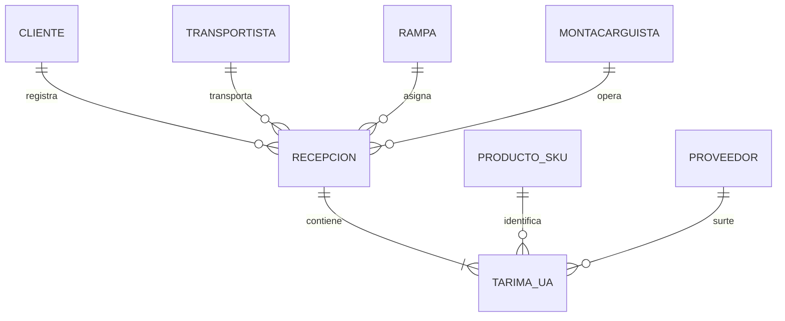
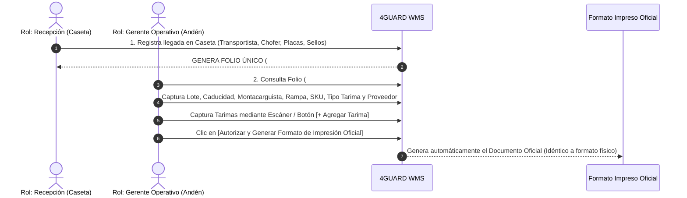

# 4GUARD WMS — Informe Ejecutivo de Avances de Desarrollo

**Cliente**: Consolidado Operativo WMS / Logística  
**Proyecto**: 4GUARD WMS — Synexia Console  
**Fecha de Emisión**: Agosto 2026  
**Alcance**: Fase I & II (Núcleo de Arquitectura, Dominio, Autenticación, Catálogos y Módulo Recepción/Descarga en 2 Pasos)

---

## 📋 1. Resumen Ejecutivo

El presente documento detalla los avances logrados en el desarrollo de la plataforma **4GUARD WMS**, un sistema integral de gestión de almacenes diseñado para optimizar el control de inventarios, la trazabilidad de la mercancía y la eficiencia en andén. 

La solución combina una experiencia de usuario moderna, limpia e intuitiva con un riguroso control transaccional alineado a las mejores prácticas de la industria logística.

---

## 🏗️ 2. Arquitectura de Sistema y Experiencia de Usuario

- **Plataforma Web de Alto Rendimiento**: Construida sobre la arquitectura **Synexia Console**, ofreciendo tiempos de respuesta instantáneos en andenes y pantallas operativas sin recargas de página.
- **Diseño Adaptativo (Modo Claro / Oscuro)**: Interfaz homologada con soporte de temas visuales para operar con máxima claridad tanto en turnos diurnos como nocturnos dentro del almacén.
- **Integridad Transaccional**: Arquitectura preparada para escalar a múltiples naves industriales, clientes y sucursales.

---

## 🗄️ 3. Modelado de Base de Datos y Dominio Operativo

Se diseñó la estructura de datos para asegurar la trazabilidad completa del producto desde su llegada en caseta hasta su despacho final:



- **Entidades de Caseta**: Bitácora de entrada vehicular, tracto, caja, chofer y sellos de seguridad.
- **Entidades de Recepción**: Folios únicos, lotes de producción, fechas de caducidad, rampas y ubicaciones de almacenaje.
- **Entidades de Tarima (UA / Unidad de Almacenamiento)**: Código de barras único, consecutivo de tarima, SKU, descripción, proveedor, piezas por tarima y tipo de estructura.

---

## 🔐 4. Autenticación y Control de Acceso (Login & Perfiles)

- **Acceso Seguro**: Pantalla de inicio de sesión con validación de credenciales.
- **Segregación de Roles Funcionales**:
  - **Rol Recepción (Caseta)**: Enfocado en el registro rápido de la llegada del transporte y la emisión del Folio Pre-Recepción.
  - **Rol Gerente Operativo / Supervisor**: Encargado de la inspección en andén, la captura detallada de productos/lotes y la adición de tarimas.
  - **Líder de Almacén**: Proporciona firmas/PIN de autorización para cierres, cancelaciones o justificaciones de auditoría.

---

## 📚 5. Catálogos Maestros Operativos

El sistema cuenta con catálogos centralizados que facilitan la selección rápida en pantallas operativas:

1. **Catálogo de Clientes y Plantas**: Registro de empresas y destinos (Ej. *Nestlé México Planta Toluca*).
2. **Catálogo de Líneas Transportadoras**: Registro de transportistas (Ej. *TMS, Transportes Castores*).
3. **Catálogo de Rampas de Andén**: Asignación y control numérico de rampas (Ej. *Rampa 01 a 12*).
4. **Catálogo de Montacarguistas**: Registro del personal asignado a maniobras (Ej. *Alan Huerta Pérez, Héctor Villalvo*).
5. **Catálogo de Productos y SKUs**: Matriz de productos con código de barras, descripción comercial y piezas estándar por tarima (Ej. *12572733 - FFEE-MATE ORIGINAL BOTELLA 12X400G N1*).
6. **Catálogo de Proveedores**: Identificación clara del fabricante o distribuidor de origen (Ej. *LE MEXICO S.A DE C.V*).
7. **Catálogo Estándar de Tipos de Tarima**:
   - `Madera`
   - `Plástico`
   - `Plástico Azul`
   - `Madera Exportación`
   - `Sin Tarima`
   - `Madera Estándar`
   - `Tarima CHEP`

---

## 📦 6. Flujo de Recepción y Descarga de Mercancía (2 Pasos)

Se implementó el flujo operativo adaptado al 100% de la operación diaria del cliente:



### **PASO 1: Registro Inicial en Caseta (Rol: Recepción)**
- Registro de llegada del vehículo: *Línea Transportadora, Hora de Llegada, No. de Remisión/Factura, Fecha del Documento, Cliente, Chofer, Placas Tracto, Placas Caja y Cinchos/Sellos de Seguridad*.
- **Generación del Folio Único de Recepción** (Ej. `#26,506`).

### **PASO 2: Descarga Operativa & Registro de Tarimas (Rol: Gerente Operativo)**
- El Gerente Operativo ingresa los parámetros de descarga: *Lote de Recepción, Fecha de Caducidad, Montacarguista, Rampa, Producto SKU, Piezas por Tarima, Tipo de Tarima, Proveedor y Observaciones*.
- **Registro de Tarimas (UAs)**: Captura consecutiva (1, 2, 3, 4...) mediante botón manual o escáner de código de barras.

---

## 🖨️ 7. Formato Oficial Impreso "RECEPCIÓN DE MERCANCÍA"

Al presionar el botón **`[ Autorizar y Generar Formato de Impresión Oficial ]`**, el sistema genera el reporte físico oficial exactamente con el formato requerido por la empresa:

```text
========================================================================================
                                      4-GUARD WMS
      Industria Automotriz 128, Delegación Santa María Totoltepec, 50200 Toluca, Méx
                              FECHA DE IMPRESIÓN: DD/MM/YYYY

                                RECEPCIÓN DE MERCANCIA
----------------------------------------------------------------------------------------
NO. RECEPCIÓN: 26,506                     FECHA RECEPCIÓN: 07/08/2026 18:00:00
LINEA TRANSPORTADORA: TMS                  NO. DOCUMENTO: 8702448268
OPERADOR: MARIA CARMINA                   FECHA DOC: 07/08/2026    CADUCIDAD: 31/07/2028
CLIENTE: NESTLE MEXICO S.A DE C.V         PLACAS TRACTO: 83BBTJ   PLACAS CAJA: 171YH1
MONTACARGUISTA: ALAN HUERTA PEREZ          LOTE: 01.07.2026         [ SELLOS SEGURIDAD ]
RAMPA DE RECEPCIÓN: 11                     LUGAR ALMACENAJE: Bodega M 98 / KT 31
----------------------------------------------------------------------------------------
N. TARIMA | CODIGO TARIMA    | SKU      | DESCRIPCIÓN         | PROVEEDOR   | TIPO   | CANT
 1        | 0376130419092430 | 12572733 | FFEE-MATE ORIGINAL  | LE MEXICO   | CHEP   | 40.00
 2        | 0376130419092431 | 12572733 | FFEE-MATE ORIGINAL  | LE MEXICO   | CHEP   | 40.00
 ...
----------------------------------------------------------------------------------------
TOTAL TARIMAS: 19                         TOTAL PZAS: 760.00
========================================================================================
CAPTURÓ: 12 PABLO VALLE MENDOZA
NOMBRE Y FIRMA: ________________________________________________________________________
```

---

## 📌 8. Estatus Actual y Hoja de Ruta Inmediata

| Módulo / Funcionalidad | Estado de Avance | Nota Operativa |
|---|---|---|
| **Arquitectura UI / UX Synexia** | 🟢 100% Completado | Alta velocidad, responsive y dark mode. |
| **Modelado de BD y Dominio** | 🟢 100% Completado | Entidades WMS, UAs y trazabilidad. |
| **Login y Autenticación** | 🟢 100% Completado | Control de acceso por roles. |
| **Catálogos Maestros** | 🟢 100% Completado | Clientes, Transportistas, Rampas, SKUs, Proveedores, Tarimas. |
| **Paso 1: Caseta Pre-Recepción** | 🟢 100% Completado | Emisión de Folios con Sellos de Seguridad. |
| **Paso 2: Descarga & UAs** | 🟢 100% Completado | Captura de tarimas por escáner y consecutivo. |
| **Formato de Impresión Oficial** | 🟢 100% Completado | Réplica exacta a formato físico con firmas. |
| **Traspasos Internos (Acomodo)** | 🟡 Siguiente Fase | Asignación a bahías en ceros (`A-14`, `M-98`). |
| **Despacho Outbound (Salidas)** | 🟡 Siguiente Fase | Reglas FIFO/FEFO y sellos obligatorios. |

---

> **Documento emitido por**: Equipo de Ingeniería y Arquitectura WMS — 4GUARD System.
