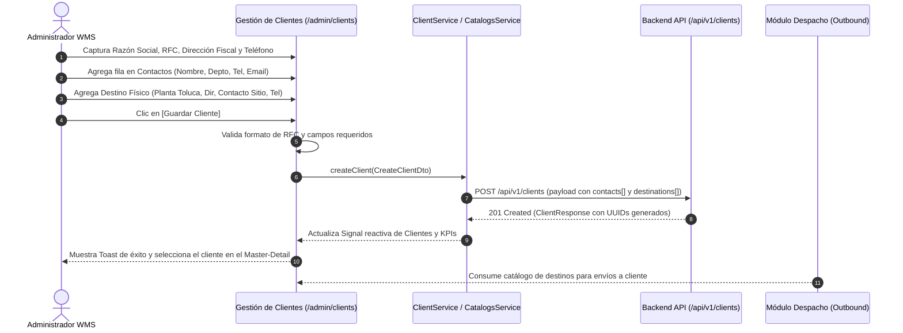
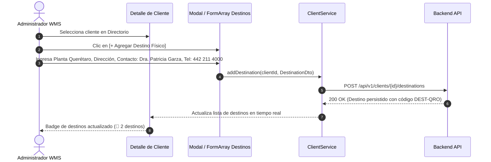

# SDD — Specification Driven Development: Gestión de Clientes (Depositantes & Destinos 3PL)

> **Módulo:** `admin / clients` & `catalogs / clients`  
> **Rutas Frontend:** `/admin/clients` · `/catalogs/clients`  
> **Tipo de Entidad:** Maestro de Negocio (Depositantes / Owners 3PL) & Puntos de Entrega (Ship-to)  
> **Patrón:** Master-Detail Workbench (Split-View 35/65) · Spec-Driven Development (SDD)  
> **Estado:** 🟢 Especificado & Adaptado  
> **Versión:** 2.0 (Soporte Multi-Bodega & Matriz de Contactos)  

---

## 1. Visión General & Objetivo

El módulo de **Gestión de Clientes** administra el catálogo maestro de empresas depositantes y dueñas de mercancía en **4GUARD WMS** (operaciones logísticas 3PL y centros de distribución propios).

### Objetivos Clave:
1. **Identidad Corporativa y Fiscal:** Registro de Razón Social, RFC fiscal homologado, organización multi-tenant y dirección fiscal/corporativa principal con teléfono de conmutador.
2. **Matriz Dinámica de Contactos:** Gestión de múltiples contactos por cliente (Logística, Finanzas, Calidad, Compras), identificando nombre, departamento, teléfono directo y correo electrónico.
3. **Múltiples Direcciones de Destino (Multi-Bodega / Multi-Planta):** Permitir que un único cliente corporativo (empresa matriz) registre y mantenga múltiples bodegas, plantas de manufactura o centros de distribución de destino (*Ship-to Locations*). Cada destino cuenta con:
   - Nombre identificador de la planta o bodega (ej. *Planta Toluca - Almacén Central*).
   - Código correlativo o ERP del destino (*`DEST-TOL-01`*).
   - Dirección física completa de entrega.
   - Persona de contacto responsable en sitio.
   - Teléfono directo de la planta o bodega.
   - Estatus operativo (*Activo / Inactivo*).
4. **Integración Transversal con Salidas / Despacho (Outbound):** Los destinos físicos registrados son consumidos reactivamente en los módulos de despacho y órdenes de salida para seleccionar la dirección exacta de entrega y el contacto receptor en destino.

---

## 2. Arquitectura de la Interfaz (Master-Detail 35/65)

La pantalla implementa el **Golden Standard de 4GUARD WMS** (Split-View 35% Directorio Master / 65% Espacio de Trabajo Unificado) en paleta *Midnight Navy & Prestige Gold*.

```
┌────────────────────────────────────────────────────────────────────────────────────────┐
│  HEADER: [Icon: partner_exchange] Administración WMS · Catálogo de Clientes             │
│  KPIs: [Total Registrados]  [Clientes Activos]  [Clientes Inactivos]  [Total Destinos] │
├──────────────────────────────────────┬─────────────────────────────────────────────────┤
│  DIRECTORIO MASTER (35%)             │  ESPACIO DE TRABAJO UNIFICADO (65%)             │
│  - Buscador tiempo real (Nombre, RFC)│  1. Datos Generales & Dirección Corporativa     │
│  - Filtro por Estado (Activo/Inact)  │     (Razón Social, RFC, Dirección Fiscal, Tel)  │
│  - Tarjetas de Clientes:             │  2. Panel Dinámico de Contactos Corporativos    │
│    • Avatar con iniciales            │     (FormArray: Nombre, Depto, Tel, Email)      │
│    • Razón Social + Código RFC       │  3. Matriz de Direcciones de Destino (Bodegas) │
│    • Badge de Destinos (🏢 N dest)   │     (Tabla / Tarjetas: Planta, Dir, Contacto)   │
│    • Badge Estado (ACTIVA / INACTIVA)│  4. Línea de Tiempo de Auditoría BE             │
│                                      │  5. Barra de Acciones: [Suspender] [Guardar]    │
└──────────────────────────────────────┴─────────────────────────────────────────────────┘
```

---

## 3. Modelo de Dominio y Contratos TypeScript

### 3.1 Contacto Corporativo (`ClientContact`)
```typescript
export interface ClientContact {
  id: string;
  clientId?: string;
  name: string;             // Nombre del contacto (ej. "Ing. Carlos Fuentes")
  department: string;       // Departamento / Área (ej. "Logística y Abasto")
  phone: string;            // Teléfono directo / móvil
  email: string;            // Correo electrónico corporativo
  isPrimary?: boolean;      // Indica si es el contacto principal
}
```

### 3.2 Dirección de Destino / Bodega Física (`PhysicalDestination` / `ClientDestination`)
```typescript
export interface PhysicalDestination {
  id: string;
  clientId?: string;
  destinationCode: string;  // Código de destino (ej. "DEST-TOL-01")
  plantName: string;        // Nombre de la planta o bodega (ej. "Planta Toluca (Café y Cacao)")
  fullAddress: string;      // Dirección completa de entrega
  contactPerson: string;    // Responsable o contacto en sitio (ej. "Ing. Fernando Ruiz")
  phone: string;            // Teléfono directo de la planta (ej. "722 279 1000")
  status: 'ACTIVO' | 'INACTIVO';
  notes?: string;           // Indicaciones especiales de acceso o descarga
}
```

### 3.3 Entidad Principal de Cliente (`CatalogClient` / `Client`)
```typescript
export type ClientStatus = 'ACTIVE' | 'INACTIVE';

export interface Client {
  id: string;                        // UUID único
  orgId: string;                     // UUID Organización multi-tenant
  orgName: string;                   // Nombre de la organización
  name: string;                      // Razón Social
  externalId: string;                // Código ERP / RFC Fiscal (ej. "NME850101K99")
  address: string;                   // Dirección Fiscal / Corporativa principal
  phone: string;                     // Teléfono corporativo principal
  email?: string;                    // Correo general
  webPortalPassword?: string;        // Contraseña de acceso al portal de autoservicio
  status: ClientStatus;              // 'ACTIVE' | 'INACTIVE'
  contacts: ClientContact[];         // Matriz de contactos corporativos
  destinations: PhysicalDestination[]; // Lista de bodegas / destinos físicos
  version: number;                   // Control de concurrencia optimista
  createdAt: string;                 // ISO 8601
  updatedAt: string;                 // ISO 8601
}
```

### 3.4 DTOs de Creación y Actualización
```typescript
export interface CreateClientDto {
  organizationId: string;
  name: string;
  externalId: string;
  address: string;
  phone: string;
  email?: string;
  webPortalPassword?: string;
  status?: ClientStatus;
  contacts: Omit<ClientContact, 'id'>[];
  destinations: Omit<PhysicalDestination, 'id' | 'destinationCode' | 'status'>[];
}

export interface UpdateClientDto {
  id: string;
  organizationId: string;
  name?: string;
  externalId?: string;
  address?: string;
  phone?: string;
  email?: string;
  status?: ClientStatus;
  contacts?: ClientContact[];
  destinations?: PhysicalDestination[];
}
```

---

## 4. Flujos Operativos y Diagramas de Secuencia

### 4.1 Alta de Cliente con Contactos y Múltiples Bodegas de Destino



### 4.2 Vinculación Rápida de Nueva Bodega / Destino a Cliente Existente



---

## 5. Reglas de Negocio (RN)

1. **RN-CLI-001 — Unicidad de RFC / External ID:** No pueden existir dos clientes activos con el mismo RFC / External ID dentro de la misma organización.
2. **RN-CLI-002 — Dirección Fiscal Obligatoria:** Todo cliente requiere una dirección corporativa/fiscal principal antes de poder ser dado de alta.
3. **RN-CLI-003 — Matriz de Contactos Mínima:** Se recomienda registrar al menos 1 contacto corporativo primario. Cada contacto debe tener nombre, teléfono y correo electrónico válido.
4. **RN-CLI-004 — Múltiples Destinos por Cliente (1:N):** Un cliente puede tener 0, 1 o múltiples destinos físicos (bodegas/plantas). Si un cliente no tiene destinos registrados, los despachos utilizarán por defecto su dirección fiscal corporativa.
5. **RN-CLI-005 — Contacto y Teléfono por Destino:** Cada destino físico registrado debe contar obligatoriamente con el nombre del responsable en sitio (`contactPerson`) y su teléfono local directo (`phone`) para coordinar la entrega con el transportista.
6. **RN-CLI-006 — Trazabilidad NOM-251 y Baja Lógica:** Los clientes con historial de inventario o movimientos transaccionales en el almacén no se eliminan físicamente (Hard Delete), sino que se desactivan (`status: 'INACTIVE'`) para mantener la integridad de auditoría.
7. **RN-CLI-007 — Sincronización con Outbound:** El módulo de Salidas / Despacho filtra y presenta únicamente los destinos con estatus `ACTIVO` pertenecientes al cliente dueño del inventario a despachar.

---

## 6. Especificación de Componentes y Formularios UI

### 6.1 Panel Maestro (Directorio Izquierdo - 35%)
- **Buscador:** Input con debounce para filtrar por Razón Social, RFC o nombre de destino.
- **Filtro de Estado:** Select con opciones `Todos`, `Activos`, `Inactivos`.
- **Item de Cliente:**
  - Avatar circular con iniciales corporativas.
  - Razón Social destacada.
  - Badge mono con RFC (`NME850101K99`).
  - Chip contador de destinos físicos: `🏢 3 destinos`.
  - Badge semántico de estatus: `ACTIVA` (verde) / `INACTIVA` (gris).

### 6.2 Espacio de Trabajo (Panel Derecho - 65%)
- **Sección 1 — Datos Generales & Dirección Fiscal:**
  - `name`: Razón Social (Requerido, min 3, max 150).
  - `externalId`: RFC / Código ERP (Requerido, regex RFC mexicano o alfanumérico ERP).
  - `phone`: Teléfono Corporativo Principal (Requerido).
  - `address`: Dirección Fiscal / Corporativa Completa (Requerido).
  - `organizationId`: Organización Multi-tenant (Requerido).
- **Sección 2 — Contactos Corporativos (`FormArray` dinámico):**
  - Botón dorado `[+ Agregar Contacto]`.
  - Filas dinámicas con: `Nombre Contacto`, `Departamento`, `Teléfono Directo`, `Correo Electrónico`, botón de eliminar fila.
- **Sección 3 — Direcciones de Destino Físico (Bodegas / Plantas):**
  - Botón dorado `[+ Agregar Destino Físico]`.
  - Cuadrícula o lista de destinos con:
    - Nombre de la Planta / Bodega (ej. *Planta Toluca*).
    - Dirección completa de entrega con icono `pin_drop`.
    - Persona de Contacto en Planta con icono `person`.
    - Teléfono de Planta con icono `call`.
    - Código de Destino correlativo generado (*`DEST-XXX`*).
- **Sección 4 — Auditoría BE & Historial:**
  - Línea de tiempo con cambios históricos obtenidos vía `GET /api/v1/clients/{id}/audit`.

---

## 7. Criterios de Aceptación (CA)

- [x] **CA-001:** La interfaz carga bajo el layout Split-View 35/65 homologado con Transportistas y Usuarios.
- [x] **CA-002:** El formulario de alta permite capturar la dirección fiscal principal y teléfono corporativo.
- [x] **CA-003:** El panel de contactos permite agregar dinámicamente múltiples contactos con validación de correo y teléfono.
- [x] **CA-004:** La sección de destinos permite registrar múltiples bodegas con nombre de planta, dirección completa, contacto en sitio y teléfono directo.
- [x] **CA-005:** Al seleccionar un cliente en el directorio, se visualiza el desglose completo de sus contactos y sus destinos vinculados.
- [x] **CA-006:** En la vista de consulta, cada tarjeta del directorio muestra el contador de destinos físicos registrados (`🏢 N destinos`).
- [x] **CA-007:** Se valida que el RFC no contenga únicamente espacios en blanco y cumpla con el formato establecido.
- [x] **CA-008:** Los destinos físicos quedan disponibles para ser consumidos por el flujo de Salidas / Outbound.
- [x] **CA-009:** La desactivación de cliente inhabilita la selección de sus destinos en nuevos movimientos de almacén.
