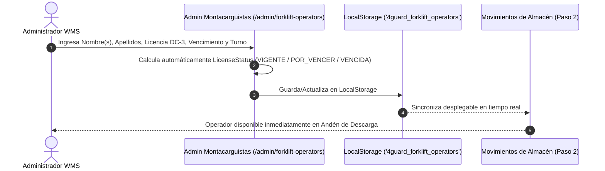

# SDD — Specification Driven Development: Administración de Montacarguistas

> **Módulo:** `admin / forklift-operators`  
> **Ruta Frontend:** `/admin/forklift-operators`  
> **Servicio Principal:** `ForkliftOperatorAdminService`  
> **Estado:** 🟢 Implementado & Homologado  

---

## 1. Visión General & Objetivo

El módulo de **Administración de Montacarguistas** gestiona la plantilla de operadores asignados a las maniobras de andén (descarga, acomodo, traspaso y despacho). 

Los montacarguistas **no son usuarios con credenciales de inicio de sesión**, sino entidades operativas vinculadas al registro transaccional de recepción en el **Paso 2 de Movimientos de Almacén**.

---

## 2. Especificación Arquitectónica y Roles (SDD)

### 👨‍💻 Software Architect
- **Persistencia Reactiva**: Manejo de estado mediante Angular 17 Signals e inyección global (`providedIn: 'root'`).
- **Persistencia LocalStorage**: Clave `'4guard_forklift_operators'`, re-evaluando automáticamente los días de vigencia de las licencias al cargar.

### 🅰️ Senior Angular Architect
- **Formularios Reactivos Estrictos**: Validación de campos requeridos (`firstName`, `lastNamePaternal`, `lastNameMaternal`, `licenseNumberDc3`, `licenseExpirationDate`, `shift`).
- **Sincronización Bidireccional**: `WarehouseMovementsService` consume reactivamente la lista de montacarguistas activos desde `ForkliftOperatorAdminService`.

### 🎨 UX/UI Product Designer (WMS Enterprise)
- **Homologación Visual**: Idéntico a la estructura de **Transportistas (`carriers`)** con cabecera Eyebrow tag `Administración WMS · Catálogo Maestro`, cuadrícula de KPIs en tiempo real y tabla con estados codificados por color.

---

## 3. Modelo de Dominio

```typescript
export type LicenseStatus = 'VIGENTE' | 'POR_VENCER' | 'VENCIDA';

export interface ForkliftOperator {
  id: string;                      // UUID / ID único
  code: string;                    // Consecutivo operativo (Ej: MC-101)
  firstName: string;               // Nombre(s)
  lastNamePaternal: string;        // Apellido Paterno
  lastNameMaternal: string;        // Apellido Materno
  fullName: string;                // Nombre completo concatenado
  licenseNumberDc3: string;        // Número de Licencia DC-3
  licenseExpirationDate: string;   // Fecha de Vencimiento (YYYY-MM-DD)
  licenseStatus: LicenseStatus;    // VIGENTE | POR_VENCER | VENCIDA
  shift: string;                   // Turno Asignado
  status: 'ACTIVO' | 'INACTIVO';   // Estatus
  createdAt: string;               // Fecha de registro
}
```

---

## 4. Flujo Operativo y Reglas de Negocio



### Reglas de Negocio:
1. **Evaluación de Licencia DC-3**:
   - `> 30 días restantes`: **VIGENTE** (Insignia Verde).
   - `0 a 30 días restantes`: **POR VENCER** (Insignia Amarilla).
   - `< 0 días (vencida)`: **VENCIDA** (Insignia Roja Parpadeante).
2. **Opciones de Turno Asignado**:
   - `Turno 1 - Matutino (06:00 - 14:00)`
   - `Turno 2 - Vespertino (14:00 - 22:00)`
   - `Turno 3 - Nocturno (22:00 - 06:00)`
3. **Baja Definitiva (Hard Delete)**: Modal de confirmación para remoción física por rotación de personal.

---

## 5. Criterios de Aceptación

- [x] Formulario con los 6 campos exactos solicitados por la operación.
- [x] Botón dorado `.btn-save-gold` (`[ 👤+ Guardar Montacarguista ]`).
- [x] Header homologado con Transportistas (`carriers`), incluyendo Eyebrow tag.
- [x] Cuadrícula de tarjetas KPI (`Total`, `Activos`, `Licencias Vigentes`, `Licencias en Alerta`).
- [x] Desplegable sincronizado en **Movimientos de Almacén (Paso 2 - Andén)**.
