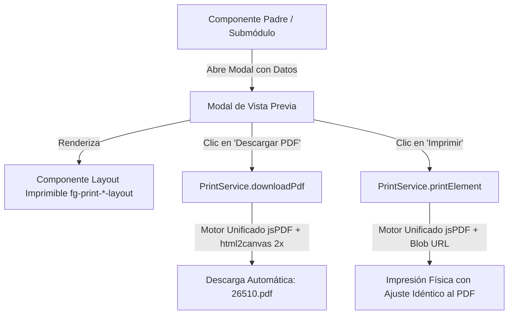

# SDD-PRINT-001: Guía y Estándar de Implementación de Comprobantes e Impresión PDF en 4GUARD WMS

- **Módulo / Ámbito:** Transversal (`apps/admin-console/src/app`)
- **Versión:** 1.0.0
- **Servicio Core:** [`PrintService`](file:4Guard_FE_UI/apps/admin-console/src/app/core/services/print.service.ts)
- **ADR Relacionado:** [`ADR-012: Arquitectura Unificada de Generación, Descarga e Impresión de Comprobantes Oficiales PDF`](file:4Guard_FE_UI/docs/adr/ADR-012-enterprise-pdf-print-export-service.md)

---

## 1. Objetivo

Este documento establece la **guía paso a paso y el patrón oficial de diseño** para integrar la generación, visualización y descarga de comprobantes oficiales en PDF (Recepción, Traspasos, Despacho, Calidad, Inventario, Etiquetas y Facturación) en cualquier módulo de **4GUARD WMS**.

---

## 2. Arquitectura de Componentes y Motor Unificado

Para asegurar **paridad visual del 100%** entre descargar el archivo PDF e imprimirlo en papel (mismas fuentes, márgenes exactos y tablas sin deformación), ambos métodos comparten el motor central `createPdfDocument`:



---

## 3. Paso a Paso para Implementar en un Nuevo Módulo

### Paso 1: Inyectar `PrintService` y Definir Signals en el Componente TypeScript

En el archivo `.component.ts` de la página:

```typescript
import { Component, inject, signal } from '@angular/core';
import { PrintService } from '../../../../core/services/print.service';
// Importar el layout imprimible específico
import { PrintQualityInspectionLayoutComponent } from '../../components/print-quality-inspection-layout.component';

@Component({
  selector: 'fg-quality-list',
  standalone: true,
  imports: [CommonModule, PrintQualityInspectionLayoutComponent],
  templateUrl: './quality-list.component.html'
})
export class QualityListComponent {
  private readonly printService = inject(PrintService);

  // Estados del modal de impresión
  readonly showPrintModal = signal<boolean>(false);
  readonly selectedItemToPrint = signal<MyEntity | null>(null);
  readonly isGeneratingPdf = signal<boolean>(false);

  // Abrir modal con la entidad seleccionada
  openPrintPreview(item: MyEntity): void {
    this.selectedItemToPrint.set(item);
    this.showPrintModal.set(true);
  }

  closePrintModal(): void {
    this.showPrintModal.set(false);
    this.selectedItemToPrint.set(null);
  }

  // 1-Clic: Descarga directa del PDF nombrado con el Folio
  async downloadDirectPdf(): Promise<void> {
    const item = this.selectedItemToPrint();
    if (!item) return;

    const folio = item.folio || item.id || 'Doc';
    this.isGeneratingPdf.set(true);
    try {
      // El selector debe coincidir con el tag del componente imprimible
      await this.printService.downloadPdf('fg-print-quality-inspection-layout', String(folio));
    } finally {
      this.isGeneratingPdf.set(false);
    }
  }

  // Impresión física en papel
  triggerBrowserPrint(): void {
    const item = this.selectedItemToPrint();
    const folio = item?.folio || item?.id || 'Doc';
    this.printService.printElement('fg-print-quality-inspection-layout', String(folio));
  }
}
```

---

### Paso 2: Plantilla HTML del Modal de Vista Previa

En el archivo `.component.html` de la página, añadir al final el modal con la estructura responsiva estandarizada:

```html
<!-- MODAL DE VISTA PREVIA DE IMPRESIÓN / DESCARGA PDF -->
@if (showPrintModal() && selectedItemToPrint(); as item) {
  <div class="modal-overlay p-2 sm:p-4">
    <div class="modal-card max-w-2xl w-full p-3 sm:p-4 space-y-2.5 max-h-[96vh] flex flex-col overflow-hidden shadow-2xl bg-white dark:bg-slate-900 border border-slate-200 dark:border-slate-800">
      
      <!-- Barra Superior Fija con Botones de Acción -->
      <div class="flex flex-wrap items-center justify-between gap-2 no-print border-b border-slate-200 dark:border-slate-800 pb-2.5 flex-shrink-0">
        <h3 class="font-black text-xs text-slate-800 dark:text-slate-100 uppercase flex items-center gap-1.5 tracking-wider">
          <span class="material-symbols-outlined text-rose-600 text-base">print</span>
          <span>VISTA PREVIA DE IMPRESIÓN</span>
        </h3>
        
        <div class="flex items-center gap-2">
          <!-- Botón Principal: Descarga Directa en 1 Clic -->
          <button
            type="button"
            (click)="downloadDirectPdf()"
            [disabled]="isGeneratingPdf()"
            class="btn-save text-xs px-3.5 py-1.5 rounded-lg font-bold flex items-center gap-1.5 shadow-sm disabled:opacity-50 transition-all hover:scale-[1.02]"
          >
            <span class="material-symbols-outlined text-sm">download</span>
            <span>{{ isGeneratingPdf() ? 'Generando...' : 'Descargar PDF (' + (item.folio || 'Doc') + '.pdf)' }}</span>
          </button>

          <!-- Botón Secundario: Impresora Física -->
          <button
            type="button"
            (click)="triggerBrowserPrint()"
            class="btn-ghost text-xs px-3 py-1.5 rounded-lg font-bold flex items-center gap-1 border border-slate-300 dark:border-slate-700 hover:bg-slate-100 dark:hover:bg-slate-800 text-slate-700 dark:text-slate-200"
          >
            <span class="material-symbols-outlined text-sm">print</span>
            <span class="hidden sm:inline">Imprimir</span>
          </button>

          <!-- Botón Cerrar -->
          <button
            type="button"
            (click)="closePrintModal()"
            class="btn-ghost text-xs px-2.5 py-1.5 rounded-lg border border-transparent hover:border-slate-200 dark:hover:border-slate-700 text-slate-600 dark:text-slate-300"
          >
            Cerrar
          </button>
        </div>
      </div>

      <!-- Contenedor del Documento con Scroll Suave Interno si la pantalla es reducida -->
      <div class="flex-1 overflow-y-auto pr-0.5">
        <fg-print-quality-inspection-layout [data]="item"></fg-print-quality-inspection-layout>
      </div>

    </div>
  </div>
}
```

---

### Paso 3: Estructura del Componente Imprimible (`fg-print-*-layout.component.ts`)

Crea el componente layout standalone en la carpeta de componentes del módulo:

```typescript
import { Component, Input } from '@angular/core';
import { CommonModule } from '@angular/common';

@Component({
  selector: 'fg-print-quality-inspection-layout',
  standalone: true,
  imports: [CommonModule],
  template: `
    <div *ngIf="data" class="print-container bg-white text-slate-900 p-4 sm:p-5 max-w-full mx-auto font-sans border-2 border-slate-900 rounded-lg shadow-sm">
      
      <!-- 1. Encabezado Institucional con Logotipo -->
      <div class="bg-slate-900 text-white p-2.5 sm:p-3 rounded-md mb-3 flex items-center justify-between shadow-xs">
        <div class="flex items-center gap-2.5">
          
          <div>
            <h1 class="text-xs sm:text-sm md:text-base font-black tracking-wider uppercase leading-tight">DICTAMEN DE INSPECCIÓN DE CALIDAD</h1>
            <p class="text-[9px] sm:text-[10px] font-semibold opacity-95">Control de Calidad e Inocuidad 4GUARD WMS</p>
          </div>
        </div>
      </div>

      <!-- 2. Rejilla de Metadatos de la Entidad -->
      <div class="grid grid-cols-2 gap-x-4 gap-y-1.5 text-[11px] mb-3 bg-slate-50 p-2.5 border border-slate-200 rounded-md">
        <div>
          <span class="font-bold text-slate-600 block text-[10px]">No. Folio:</span>
          <span class="font-mono font-bold text-slate-900 text-xs sm:text-sm">#{{ data.folio }}</span>
        </div>
        <div>
          <span class="font-bold text-slate-600 block text-[10px]">Fecha:</span>
          <span class="font-medium text-slate-900">{{ data.createdAt }}</span>
        </div>
        <div>
          <span class="font-bold text-slate-600 block text-[10px]">Cliente / Proveedor:</span>
          <span class="font-medium text-slate-900 truncate block">{{ data.client }}</span>
        </div>
        <div>
          <span class="font-bold text-slate-600 block text-[10px]">Estatus:</span>
          <span class="font-bold text-emerald-700 uppercase">{{ data.status }}</span>
        </div>
      </div>

      <!-- 3. Tabla de Partidas / Detalle -->
      <div class="mb-3">
        <h3 class="text-[10px] font-bold text-slate-700 mb-1 uppercase tracking-wider">Detalle de Partidas:</h3>
        <div class="overflow-x-auto rounded border border-slate-200">
          <table class="w-full text-left text-[11px]">
            <thead>
              <tr class="bg-slate-100 font-bold text-slate-700 border-b border-slate-200">
                <th class="py-1.5 px-2">Código</th>
                <th class="py-1.5 px-2">Descripción</th>
                <th class="py-1.5 px-2 text-right">Cantidad</th>
              </tr>
            </thead>
            <tbody>
              <tr *ngFor="let item of data.items" class="border-b border-slate-100 hover:bg-slate-50/80">
                <td class="py-1 px-2 font-mono font-bold text-slate-900">{{ item.code }}</td>
                <td class="py-1 px-2 text-slate-800">{{ item.description }}</td>
                <td class="py-1 px-2 text-right font-mono font-bold text-slate-900">{{ item.quantity }}</td>
              </tr>
            </tbody>
          </table>
        </div>
      </div>

      <!-- 4. Pie de Firmas y Auditoría -->
      <div class="mt-4 pt-3 border-t border-slate-200 grid grid-cols-2 gap-6 items-end">
        <div class="text-[10px]">
          <p class="font-bold text-slate-900 text-[11px]">Inspector: {{ data.inspectorName }}</p>
          <p class="text-slate-400 text-[9px]">Documento auditado de seguridad 4GUARD WMS</p>
        </div>
        <div class="text-center">
          <div class="border-b border-slate-800 w-full mb-1"></div>
          <p class="font-bold text-[9px] sm:text-[10px] uppercase tracking-widest text-slate-800">FIRMA Y SELLO</p>
        </div>
      </div>

    </div>
  `
})
export class PrintQualityInspectionLayoutComponent {
  @Input() data!: any;
}
```

---

## 4. Reglas Críticas de Estilo y Calidad

1. **Margen Cero en `@page`:**
   - La regla `@page { size: letter portrait; margin: 0 !important; }` configurada en [`styles.scss`](file:///c:/Users/lenovo/Documents/ProyectosSyborX/4Guard/4Guard_FE_UI/apps/admin-console/src/styles.scss) y [`PrintService`](file:///c:/Users/lenovo/Documents/ProyectosSyborX/4Guard/4Guard_FE_UI/apps/admin-console/src/app/core/services/print.service.ts) garantiza que **ningún navegador inserte fecha, URL ni paginación en las orillas**.
2. **Escalado `html2canvas` a 2x:**
   - `PrintService.downloadPdf` utiliza `scale: 2` de forma predeterminada para que el PDF descargado tenga resolución retina sin pixelado en códigos de barras o textos pequeños.
3. **Ancho Proporcional `max-w-2xl`:**
   - Mantener siempre el modal de vista previa en `max-w-2xl` (672px) para que en pantalla simule con exactitud la hoja Letter vertical al 100% de zoom.
