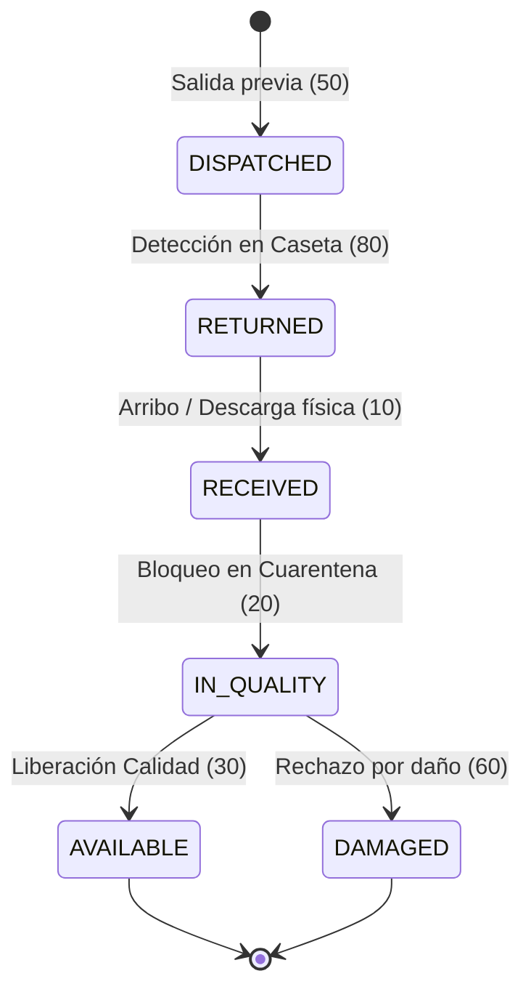

# SDD: Gestión de Reingresos, Logística Inversa y Trazabilidad Multiciclo

- **Versión:** 2.0.0
- **Fecha:** 2026-10-08
- **ADR de Referencia:** [ADR-021](../adr/ADR-021-gestion-reingresos-logistica-inversa-trazabilidad.md)
- **Framework:** SDOP (Spec-Driven Oracle-Bridge)

---

## 1. Alcance y Objetivos

Definir los contratos de datos, especificaciones de endpoints REST, reglas de negocio y ciclo de vida de la máquina de 8 estados para el manejo integral de **Logística Inversa, Auto-Detección de Retornos y Verificación Física en Andén** en 4GUARD WMS.

---

## 2. Contratos de Endpoints REST

### 2.1 Auto-Detección Inteligente de Retornos
- **Ruta:** `GET /api/v1/warehouse-receptions/detect-return`
- **Query Params:**
  - `query`: `string` (Número de remisión, folio `SAL-YYYY-XXXXXX` o lote).
  - `organizationId`: `UUID` (Opcional).
  - `branchId`: `UUID` (Opcional).
- **Respuesta:** `ApiResponse<ReturnDetectionResponse>`

```typescript
export interface ReturnDetectionResponse {
  isReturn: boolean;
  sourceOutboundId?: string;
  sourceOutboundFolio?: string;
  remisionNo?: string;
  clientId?: string;
  clientName?: string;
  carrierId?: string;
  carrierName?: string;
  driverName?: string;
  tractorPlates?: string;
  boxPlates?: string;
  dispatchedAt?: string;
  totalPallets?: number;
  totalPieces?: number;
  destinationName?: string;
  expectedPallets: ExpectedReturnPalletDto[];
}

export interface ExpectedReturnPalletDto {
  itemId?: string;
  palletCode: string;
  lotNumber?: string;
  skuId?: string;
  skuCode?: string;
  productName?: string;
  pieces: number;
  expirationDate?: string;
  palletType?: string;
}
```

### 2.2 Verificación Física de UA en Andén
- **Ruta:** `POST /api/v1/warehouse-receptions/{id}/verify-pallet`
- **Body:** `VerifyPalletRequest`
```typescript
export interface VerifyPalletRequest {
  palletCode: string;
}
```
- **Respuesta:** `ApiResponse<VerifyPalletResponse>`
```typescript
export interface VerifyPalletResponse {
  valid: boolean;
  status: 'VERIFIED' | 'ALREADY_VERIFIED' | 'DISCREPANCY';
  palletId?: string;
  palletCode: string;
  lotNumber?: string;
  skuCode?: string;
  productName?: string;
  pieces?: number;
  expirationDate?: string;
  verifiedCount: number;
  totalExpected: number;
  remainingCount: number;
  message: string;
}
```

### 2.3 Árbol de la Vida de Remisión (Audit Trail Multiciclo)
- **Ruta:** `GET /api/v1/warehouse-receptions/remissions/{folio}/tree`
- **Respuesta:** `ApiResponse<InventoryAuditLogEntity[]>`

---

## 3. Máquina de 8 Estados del Inventario en Retornos



1. **DISPATCHED (50):** Estado original al momento del despacho inicial.
2. **RETURNED (80):** Estado transicional asignado al detectar el retorno y completar pre-checkin.
3. **RECEIVED (10):** Tarima descargada y verificada físicamente en el andén.
4. **IN_QUALITY (20):** Retención preventiva automática para inspección de inocuidad y empaque.
5. **AVAILABLE (30) / DAMAGED (60):** Veredicto formal emitido por el inspector de Calidad.
