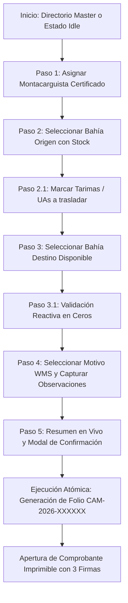

# SDD — Cambio de Almacén (Reubicación de Inventario)

**Proyecto:** 4GUARD WMS  
**Módulo:** Operación y Logística → Movimientos de Almacén → Cambio de Almacén  
**Tipo de Operación:** Transaccional de Inventario / Reubicación de UAs (Putaway & Relocation)  
**Estado:** Aprobado e Implementado  
**Versión:** 1.1 (Arquitectura Master-Detail Unificada)  
**Patrón:** Spec-Driven Development (SDD)  
**Autor:** Equipo de Ingeniería 4GUARD / Synexia Framework  

---

## 1. Objetivo

Implementar el módulo **Cambio de Almacén** en la plataforma **4GUARD WMS** para permitir al personal operativo autorizado reubicar una o más unidades de almacenamiento (tarimas / UAs) desde una bahía de origen hacia una bahía destino disponible (en ceros o con capacidad libre), garantizando:

1. **Integridad del Inventario:** Descuento atómico en la bahía origen e ingreso inmediato en la bahía destino.
2. **Trazabilidad Integral:** Generación de un folio correlativo único de auditoría (`CAM-YYYY-XXXXXX`).
3. **Control y Auditoría:** Asignación obligatoria de montacarguista certificado con turno activo y registro de usuario emisor.
4. **Comprobante Operativo Imprimible:** Emisión de un formato formal con desglose de tarimas, piezas, lotes y tres bloques de firma (*Montacarguista*, *Operador WMS*, *Supervisor*).

---

## 2. Arquitectura de la Interfaz (Master-Detail Workbench)

La interfaz se encuentra 100% homologada con los módulos de **Recepción de Mercancía** y **Gestión de Transportistas**, operando bajo el patrón **Master-Detail Workbench** en una sola pantalla sin sub-pestañas redundantes:

### 2.1 Tarjetas KPI Superiores (4 Métricas en Tiempo Real)
* **Total Traspasos (`local_shipping` / `swap_horiz`):** Conteo histórico de operaciones de cambio de almacén completadas.
* **Bahías con Stock (`warehouse`):** Cantidad de bahías ocupadas que contienen existencias disponibles para reubicar.
* **Bahías en Ceros (`check_circle`):** Cantidad de bahías libres disponibles para recibir nuevas tarimas.
* **UAs Reubicadas (`move_to_inbox`):** Total acumulado de tarimas físicas reubicadas.

### 2.2 Panel Izquierdo: Directorio Master de Traspasos (4 Columnas)
* **Encabezado y Acción:** Título `DIRECTORIO DE TRASPASOS` con botón institucional dorado **`[ + Nuevo Traspaso ]`**.
* **Buscador en Tiempo Real:** Filtro rápido por Folio (`CAM-2026-XXXXXX`), Bahía Origen, Bahía Destino, Montacarguista o Motivo.
* **Lista Scrollable de Tarjetas (`.reception-item-card`):**
  * Folio en color dorado (`#CAM-2026-000001`).
  * Ruta de movimiento monospaciada (`A-14 ➔ M-98`).
  * Total de tarimas trasladadas (`2 Tarima(s)`).
  * Montacarguista asignado y hora del movimiento.
  * Badge de estado completado (`status-badge--completed`).
  * Borde y resaltado dorado activo al seleccionar cualquier elemento.

### 2.3 Panel Derecho: Espacio de Trabajo Unificado (8 Columnas)
El panel derecho opera en tres modos reactivos controlados por `formMode: 'idle' | 'create' | 'detail'`:

1. **Modo Inicial / Sin Selección (`formMode: 'idle'`):**
   * Tarjeta centrada con ícono en marco dorado, título *"Sin selección"*, texto de ayuda y botón de acción directa **`[ + Nuevo cambio de almacén ]`**.
2. **Modo Captura / Alta de Traspaso (`formMode: 'create'`):**
   * Cabecera breadcrumb `Movimientos > Reubicación de Inventario > EN PROCESO [Modo Captura]`.
   * Formulario continuo de 5 pasos transaccionales con leyendas doradas (`.form-section__legend`) y botón de cancelar.
3. **Modo Detalle / Consulta Histórica (`formMode: 'detail'`):**
   * Cabecera breadcrumb `Movimientos > Reubicación de Inventario > FOLIO #CAM-2026-XXXXXX [Completado]`.
   * Ficha de información general con campos `.fg-field` y etiquetas `.fg-label`.
   * Matriz visual de origen y destino (`Bahía Origen [Desocupada] ➔ Bahía Destino [Ubicación Actual]`).
   * Desglose de tarimas/UAs reubicadas con SKUs y piezas.
   * Botón de acción **`[ 🖨️ Imprimir Comprobante ]`**.

---

## 3. Flujo Operativo Transaccional (5 Pasos)



### Detalle de los Pasos:
* **Paso 1 — Asignación de Montacarguista:** Selector de operador certificado con visualización de turno operativo (Matutino, Vespertino, Nocturno) y badge de estatus activo.
* **Paso 2 — Bahía Origen e Inventario:** Selector dinámico de bahía con existencias (`occupiedLocations`), metadatos físicos (Zona, Pasillo, Rack, Nivel, Capacidad) y tabla de tarimas con checkboxes para selección selectiva o masiva (*Seleccionar todas*).
* **Paso 3 — Bahía Destino (Validación en Ceros):** Selector de bahía disponible (`availableLocations`) con validación visual en tiempo real (*"Bahía Destino Disponible (0 UAs)"* o alerta de ocupación previa).
* **Paso 4 — Motivo y Observaciones:** Catálogo institucional de motivos WMS y caja de texto libre para justificación operativa.
* **Paso 5 — Resumen en Vivo y Confirmación:** Cajas totalizadoras (*Total Tarimas*, *SKUs Distintos*, *Piezas Totales*), modal de confirmación con doble verificación y ejecución transaccional.

---

## 4. Modelo de Datos y Contratos TypeScript

### 4.1 Entidad Principal: `WarehouseTransfer`
```typescript
export interface WarehouseTransfer {
  id: string;                          // Identificador interno único
  folio: string;                       // Folio correlativo oficial: 'CAM-YYYY-XXXXXX'
  status: 'COMPLETED' | 'CANCELLED';   // Estado del movimiento
  forkliftOperator: string;            // Nombre del montacarguista
  forkliftOperatorId: string;          // Código de gafete: 'MC-101'
  originLocation: string;              // Código de bahía origen (ej. 'A-14')
  destinationLocation: string;         // Código de bahía destino (ej. 'M-98')
  reasonId?: string;                   // Código de motivo WMS
  reasonLabel?: string;                // Descripción del motivo
  observations?: string;               // Justificación u observaciones
  pallets: WarehousePallet[];          // Lista de tarimas/UAs transferidas
  totalPallets: number;                // Total de tarimas movidas
  totalPieces: number;                 // Suma de piezas transferidas
  distinctSkus: number;                // Número de SKUs únicos transferidos
  clientName?: string;                 // Cliente / Propietario del inventario
  timestamp: string;                   // Hora de registro (HH:mm)
  transferredAt: string;               // Fecha y hora completa
  transferredBy: string;               // Usuario administrativo emisor
}
```

### 4.2 Entidad de Tarima / UA: `WarehousePallet`
```typescript
export interface WarehousePallet {
  id: string;
  palletCode: string;                  // Código UA / SSCC (ej. 'UA-77101')
  description: string;                 // Descripción comercial del producto
  productId: string;                   // Código SKU
  pieces: number;                      // Cantidad de piezas en la tarima
  palletTypeId: 'MADERA_ESTANDAR' | 'PLASTICO_REFORZADO' | 'CHEP_AZUL';
  palletTypeLabel: string;             // 'Tarima Madera Estándar (1.00 x 1.20 m)'
  supplierName?: string;               // Propietario / Proveedor
  observations?: string;
}
```

### 4.3 Información de Stock de Bahía: `LocationStockInfo`
```typescript
export interface LocationStockInfo {
  locationCode: string;                // Ej. 'A-14', 'M-98'
  warehouseName?: string;              // Ej. 'Bodega Principal', 'Bodega M 98'
  zone?: string;                       // Ej. 'Zona A - Alimentos Secos'
  aisle?: string;                      // Ej. 'Pasillo 04'
  rack?: string;                       // Ej. 'Rack 04'
  level?: string;                      // Ej. 'Nivel 01 (Piso)'
  capacity: number;                    // Capacidad máxima de tarimas (default: 4)
  occupancy: number;                   // Tarimas actuales
  availableCapacity: number;           // Capacidad disponible
  isBlocked?: boolean;                 // Bloqueo operativo de la bahía
  totalPallets: number;
  totalPieces: number;
  pallets: WarehousePallet[];
}
```

### 4.4 Catálogo Oficial de Motivos de Reubicación
```typescript
export interface TransferReasonItem {
  id: string;
  label: string;
  description: string;
}

export const TRANSFER_REASONS: TransferReasonItem[] = [
  { id: 'OPT_ESPACIO', label: 'Optimización de Espacio / Consolidación', description: 'Reacomodo para liberar pasillos o concentrar inventario afín.' },
  { id: 'ROT_FIFO_FEFO', label: 'Rotación Operativa (FIFO / FEFO)', description: 'Acercamiento a andén de salida por orden de caducidad o despacho próximo.' },
  { id: 'MANTENIMIENTO', label: 'Mantenimiento Preventivo / Bahía Dañada', description: 'Reubicación temporal por reparación física de rack o piso.' },
  { id: 'REASIGN_CLIENTE', label: 'Reasignación de Zona por Cliente', description: 'Segregación física por cambio de condiciones comerciales o requerimiento del cliente.' },
  { id: 'AUDITORIA_CALIDAD', label: 'Muestreo de Calidad / Cuarentena', description: 'Traslado a bahía de inspección o aislamiento preventivo.' },
  { id: 'OTRO', label: 'Otro Motivo Operativo', description: 'Reubicación especificada en el campo de observaciones.' },
];
```

---

## 5. Reglas de Negocio (RN)

* **RN-001 — Montacarguista Certificado Obligatorio:** Toda maniobra física de reubicación debe tener un operador de montacargas asignado con estatus activo en el turno correspondiente.
* **RN-002 — Origen con Existencias Reales:** La bahía origen seleccionada debe poseer al menos 1 tarima física. No es posible ejecutar un traspaso sin marcar al menos una UA.
* **RN-003 — Validación de Bahía Destino en Ceros / Capacidad:** La bahía destino debe pertenecer a la misma sucursal, no estar bloqueada y contar con capacidad disponible para recibir las UAs seleccionadas.
* **RN-004 — Restricción Origen ≠ Destino:** La bahía origen y la bahía destino deben ser estrictamente distintas.
* **RN-005 — Atomicidad Transaccional:** La salida de las UAs en la bahía origen y su ingreso en la bahía destino se efectúan en una única transacción atómica en memoria/base de datos.
* **RN-006 — Inmutabilidad Histórica:** Un folio generado (`CAM-YYYY-XXXXXX`) no puede ser editado ni sobreescrito. Las consultas históricas operan en modo solo lectura.
* **RN-007 — Formato de Folio Oficial:** El folio se genera con el prefijo `CAM-` seguido del año en curso y un correlativo numérico de 6 dígitos con ceros a la izquierda (ej. `CAM-2026-000001`).
* **RN-008 — Persistencia Inteligente:** El estado del módulo se sincroniza en almacenamiento local para preservar el workbench activo durante recargas o cambios en vivo.

---

## 6. Comprobante Oficial Imprimible (`fg-print-transfer-layout`)

El formato impreso cumple con la directriz institucional de 4GUARD WMS:
1. **Encabezado Institucional:** Logotipo 4GUARD, nombre del almacén, fecha de emisión, tipo de documento (*"Comprobante Oficial de Cambio de Almacén"*).
2. **Caja de Folio:** Folio oficial destacado `CAM-2026-XXXXXX` y badge de estado.
3. **Ficha de Operadores:** Usuario administrativo emisor y Montacarguista responsable de la maniobra.
4. **Matriz de Reubicación Física:**
   * **Bahía Origen:** Código, Zona, Pasillo, Rack, Nivel.
   * **Bahía Destino:** Código, Zona, Almacén físico.
5. **Justificación:** Motivo seleccionado y notas complementarias.
6. **Tabla de Unidades de Almacenamiento (UAs):** Código de Tarima, SKU, Descripción de Producto, Tipo de Tarima y Cantidad de Piezas.
7. **Totalizadores:** Total de Tarimas, Piezas Totales y SKUs distintos.
8. **Tres Bloques de Firma:**
   * `Firma Montacarguista (Maniobra Física)`
   * `Firma Operador WMS (Captura en Sistema)`
   * `Firma Supervisor de Almacén (Visto Bueno / Auditoría)`

---

---

## 8. Control y Auditoría Homologada

En el modo detalle (`formMode === 'detail'`), se despliega la sección **"Información de Control & Auditoría"** homologada con el estándar WMS:
1. **Metadatos Rápidos:** Grid de 4 columnas con Folio de Movimiento, Organización (`4GUARD LOGISTICS CORP`), Registrado Por (`@usuario`), Fecha de Operación.
2. **Línea de Tiempo Interactiva:** Registro cronológico de eventos con nodos codificados por color:
   * `TRASPASO_REGISTRADO` (Verde Esmeralda `.carriers-tl-node--emerald`): Registro de reubicación con origen, destino, montacarguista y total de UAs/piezas.
   * `TRASPASO_COMPLETADO` (Azul `.carriers-tl-node--blue`): Confirmación de acomodo físico.
   * `TRASPASO_CANCELADO` (Rojo `.carriers-tl-node--red`): Revocación con motivo y autorizador.

---

## 9. Criterios de Aceptación (CA)

| Código | Criterio de Aceptación | Estado |
| :--- | :--- | :---: |
| **CA-001** | La pantalla carga en arquitectura Master-Detail con 4 KPIs horizontales. | ✅ Cumplido |
| **CA-002** | El estado inicial sin selección muestra la tarjeta con botón `+ Nuevo cambio de almacén`. | ✅ Cumplido |
| **CA-003** | El botón `+ Nuevo Traspaso` del directorio y de la tarjeta idle activa el formulario de captura. | ✅ Cumplido |
| **CA-004** | El selector de montacarguistas muestra turno y estatus activo. | ✅ Cumplido |
| **CA-005** | Las bahías con stock cargan automáticamente sus tarimas con checkboxes. | ✅ Cumplido |
| **CA-006** | Es posible seleccionar tarimas individuales o usar el botón "Seleccionar todas". | ✅ Cumplido |
| **CA-007** | El selector destino valida que la bahía esté libre y muestra badge verde de confirmación. | ✅ Cumplido |
| **CA-008** | Los totalizadores en vivo (Tarimas, SKUs, Piezas) se calculan en tiempo real. | ✅ Cumplido |
| **CA-009** | El botón de confirmación se deshabilita si no se cumplen las validaciones. | ✅ Cumplido |
| **CA-010** | El modal de confirmación tiene fondo sólido opaco y alto contraste. | ✅ Cumplido |
| **CA-011** | La ejecución descuenta el stock de origen, suma en destino y genera folio `CAM-2026-XXXXXX`. | ✅ Cumplido |
| **CA-012** | Tras la confirmación, se abre automáticamente el comprobante imprimible oficial con 3 firmas. | ✅ Cumplido |
| **CA-013** | Al seleccionar un registro del directorio izquierdo, se abre la vista detalle de solo lectura con sección de Auditoría. | ✅ Cumplido |
| **CA-014** | La barra de breadcrumb no contiene botones redundantes y se homologa 1:1 con Recepción. | ✅ Cumplido |
| **CA-015** | La tipografía utiliza `Outfit`, `Inter` y `JetBrains Mono` con colores Midnight Navy & Prestige Gold y soporte Dark Mode. | ✅ Cumplido |

